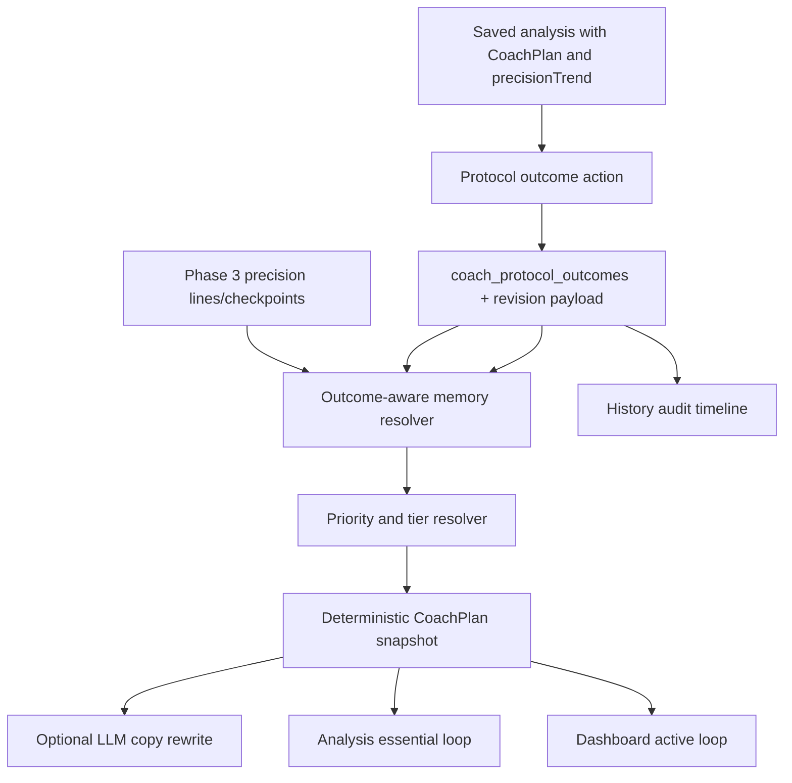

# Phase 4: Adaptive Coach Loop - Research

**Researched:** 2026-05-05T18:43:42-03:00
**Domain:** Deterministic adaptive coaching, outcome persistence, coach memory, schema-bound LLM rewrite, and analysis/history/dashboard UI surfaces
**Confidence:** HIGH

<user_constraints>
## User Constraints (from CONTEXT.md)

### Locked Decisions

#### Outcome do protocolo
- **D-01:** Protocol outcome evaluates both the protocol and the primary focus. The product must know whether the whole block was executed and which focus the outcome applies to.
- **D-02:** Outcome status must support: `started`, `completed`, `improved`, `unchanged`, `worse`, and `invalid_capture`. Exact enum names may be chosen by the planner, but these meanings are locked.
- **D-03:** User-reported `improved` is useful but weak evidence until a compatible validation clip confirms it.
- **D-04:** If the user gives no feedback, the coach keeps the protocol as pending and the dashboard prompts closure without blocking normal product use.
- **D-05:** Saving an outcome should not require an immediate clip, but the UI must show a strong CTA to record a compatible validation clip.
- **D-06:** If the user reports improvement and the next compatible clip worsens, the coach records an explicit conflict and asks for short validation. It must not rush to a conclusion.
- **D-07:** Outcome records must store structured reason codes plus an optional short free-text note.
- **D-08:** The coach must distinguish protocol failure from execution failure when the user provides a reason, and may use the next clip to support that distinction without inventing certainty.
- **D-09:** `started` means the protocol is in progress. It can expire if not closed and does not count as technical evidence.
- **D-10:** `completed` without result is neutral evidence with a CTA to mark whether the block improved, stayed the same, worsened, or became invalid.
- **D-11:** `invalid_capture` must require a reason such as capture quality, incompatible context, bad execution, or changed variable. It should become learning, not discarded noise.
- **D-12:** Outcomes can be corrected after saving, but revisions must remain auditable.

#### Memoria e prioridade adaptativa
- **D-13:** Coach memory has two layers: strict compatible-context memory and global player memory.
- **D-14:** Strict compatible memory is primary. Global memory may break ties or help when strict compatible memory is absent, but it cannot override compatible evidence.
- **D-15:** Compatible memory uses a hybrid window: recent compatible clips plus a time limit, so stale history does not dominate current coaching.
- **D-16:** Priority combines recurrence, current severity, evidence quality, compatible trend state, and prior outcome. It must not be driven only by the latest diagnosis or only by old history.
- **D-17:** If a prior protocol worsened, the next coach lowers aggressiveness and creates or asks for an alternative hypothesis instead of blindly repeating the same advice.
- **D-18:** If a protocol improved and the compatible clip confirmed progress, the coach consolidates before changing variable.
- **D-19:** Strong memory requires at least three compatible clips, or two compatible clips plus a coherent outcome. Exact thresholds remain planner discretion, but this conservative bar is locked.
- **D-20:** Every session should preserve an auditable snapshot of why the coach chose its tier, primary focus, protocol, and validation.
- **D-21:** `worse` with invalid capture is not technical evidence against the protocol. It is stored as invalid outcome plus execution/capture friction and asks for a new validation.
- **D-22:** Repeated `completed` outcomes without result remain neutral, reduce outcome-memory confidence, and prompt the user to close the result before the coach advances too far.
- **D-23:** When user outcome and compatible trend disagree, the coach records explicit conflict, gives stronger weight to trend evidence, and requires new validation before advancing.
- **D-24:** If the same focus fails twice, the coach lowers aggressiveness, searches for a prior/root cause, asks whether execution or capture interfered, and only keeps the focus if the current clip still proves it is dominant.
- **D-25:** If one focus improves while another worsens, the coach treats it as partial progress. It may consolidate only if the new blocker is not critical.
- **D-26:** Memory visibility is layered: analysis shows only the essential reason, dashboard shows short active memory, and history shows complete audit.

#### Agressividade do coach
- **D-27:** `apply_protocol` requires strong current evidence, compatible memory without conflict, and recent validation. A single strong-looking clip is not enough.
- **D-28:** `stabilize_block` is used when the technical signal is useful but variance, history, or trend evidence does not yet allow a stronger action, especially before sensitivity changes.
- **D-29:** If sensitivity and technique point in different directions, the coach chooses the least irreversible safe path: technique/validation before sensitivity unless strong compatible evidence supports sensitivity.
- **D-30:** If the user wants an aggressive action on weak evidence, the coach downgrades it to a test protocol, offers the safer path, and explains why the stronger action is blocked.
- **D-31:** The coach must not repeat the same protocol blindly. Repetition requires a new hypothesis, new check, or new validation purpose.
- **D-32:** The coach changes the variable in test only after consolidation, invalidation, or proof that another variable became critical.
- **D-33:** Conflict between human outcome and compatible clip blocks `apply_protocol` and routes to short validation.
- **D-34:** Strong history with a weak current clip can provide context, but cannot authorize a strong plan without a usable current clip.
- **D-35:** Strong current clip with prior failed history should become a revised controlled test, not immediate apply.
- **D-36:** When current clip, trend, and outcomes align, the coach may use a firmer premium tone, but must still include explicit validation.

#### Superficie e guardrails
- **D-37:** Post-analysis should show only the essential coach loop: coach verdict, primary focus, next block, and CTA for outcome or compatible validation.
- **D-38:** Dashboard should show the active loop: protocol in progress, pending feedback, next validation, and short memory summary.
- **D-39:** History is the audit surface: outcomes, revisions, conflicts, coach snapshots, compatible clips, precision checkpoints, and memory explanations.
- **D-40:** LLM rewrite is copy-only. It cannot change tier, priority, order, scores, thresholds, validations, attachments, status, blocker reasons, outcome facts, or technical payloads.
- **D-41:** Coach copy should be direct, demanding, premium, and honest. It may sound confident when evidence aligns, but it must not promise perfection, definitive sensitivity, rank gain, or guaranteed improvement.
- **D-42:** Phase 4 needs targeted tests and relevant golden/benchmark checks covering coach tier, primary focus, next block, outcome handling, historical conflict, LLM schema preservation, and memory behavior.

### the agent's Discretion

The planner/researcher may choose exact table names, enum names, migration shape, UI component boundaries, memory threshold constants, and test file organization. That discretion does not include weakening the evidence gates, hiding conflict, letting user outcomes override incompatible clip evidence, letting global memory override strict compatible memory, or allowing LLM output to alter technical facts.

### Deferred Ideas (OUT OF SCOPE)

- Full visual/UI refactor for a more premium app-wide experience belongs in a dedicated later phase.
- Monetization limits, Pro pricing, billing, entitlements, and paid feature gates belong to Phase 5.
- Team/coach multi-player review workflows belong to Phase 6.
- Real-time in-game coaching, overlays, and native/mobile experiences remain out of scope.
</user_constraints>

<phase_requirements>
## Phase Requirements

| ID | Description | Research Support |
|----|-------------|------------------|
| COACH-01 | User receives one primary focus, up to two secondary focuses, and one next-block protocol after each usable analysis. | Existing `CoachPlan` already exposes `primaryFocus`, `secondaryFocuses`, `actionProtocols`, and `nextBlock`; planning should tighten limits and validation language. [VERIFIED: src/types/engine.ts, src/core/coach-plan-builder.ts] |
| COACH-02 | Coach plan uses diagnostics, sensitivity, clip quality, context, and history before choosing a recommendation. | Existing extraction covers video quality, diagnoses, sensitivity, context, and memory signals; planning should add outcome-aware memory and stricter tier inputs. [VERIFIED: src/core/coach-signal-extractor.ts, src/core/coach-memory.ts] |
| COACH-03 | User can record whether a coach protocol was accepted, completed, improved, failed, or inconclusive. | Current persistence only records sensitivity outcome; plan needs protocol/focus outcome contracts, server action, UI, and revision audit. [VERIFIED: src/actions/history.ts, src/app/history/[id]/sensitivity-acceptance-panel.tsx] |
| COACH-04 | Coach memory can use prior compatible clips and outcomes to adjust priority and confidence. | Phase 3 provides strict precision trend summaries and persisted checkpoints; existing memory consumes compatible sessions but not full protocol outcomes. [VERIFIED: .planning/phases/03-multi-clip-precision-loop/*-SUMMARY.md, src/core/coach-memory.ts] |
| COACH-05 | Optional LLM rewrite cannot alter tier, priority order, scores, attachments, thresholds, or technical facts. | Existing adapter accepts only allowed plan copy fields and rejects schema/id/key drift; plan should extend this guard to outcome facts/status/blockers. [VERIFIED: src/core/coach-llm-contract.ts, src/core/coach-llm-adapter.ts] |
</phase_requirements>

## Summary

Phase 4 should extend the current deterministic Coach Extremo spine instead of replacing it. The codebase already has a typed `CoachPlan`, signal extraction, priority ranking, decision tiering, a compatible memory snapshot, optional Groq/OpenAI-compatible LLM rewrite, and post-analysis/history/dashboard surfaces. [VERIFIED: src/types/engine.ts, src/core/coach-plan-builder.ts, src/core/coach-memory.ts, src/core/coach-llm-adapter.ts]

The missing product contract is first-class protocol outcome memory. Today, user feedback is stored as sensitivity acceptance on the saved analysis payload; it is useful, but it cannot distinguish started/completed/improved/unchanged/worse/invalid capture, cannot bind the result to the primary focus and protocol, and does not preserve revision history. [VERIFIED: src/actions/history.ts, src/app/history/[id]/sensitivity-acceptance-panel.tsx]

**Primary recommendation:** Plan Phase 4 as four ordered lanes: outcome contract/persistence, adaptive memory and aggressiveness, layered coach loop UI, then LLM/benchmark hardening. Keep all coaching truth deterministic, use Drizzle/Postgres plus stored snapshots for auditability, and preserve browser-first clip analysis.

## Architectural Responsibility Map

| Capability | Primary Tier | Secondary Tier | Rationale |
|------------|--------------|----------------|-----------|
| Protocol outcome contract | Shared TypeScript domain | Database / Server actions | Outcomes are consumed by core memory, actions, UI, hydration, tests, and LLM guardrails. |
| Outcome persistence and revision audit | Database / Server actions | History UI | Authenticated writes need user ownership checks, audit payloads, and revalidation. |
| Outcome-aware coach memory | Core deterministic domain | Server action save/read flow | Memory must run before rendering or saving coach plans and must not depend on client claims alone. |
| Tier/aggressiveness rules | Core deterministic domain | Benchmark runner | `apply_protocol`, conflict, consolidation, and stabilization are product truth, not copy. |
| Post-analysis outcome CTA | Browser / Client UI | Server action | The immediate surface should stay small and quick, then call an authenticated action. |
| Dashboard active loop | Frontend server / RSC read model | View model | Dashboard summarizes pending protocol, memory conflict, and next validation. |
| History audit | Frontend server / RSC read model | Database | Full audit belongs in history with outcomes, revisions, snapshots, checkpoints, and blockers. |
| LLM rewrite guardrail | Core adapter / Server LLM client | Tests / benchmark | LLM only rewrites allowed copy fields and must preserve all technical facts. |
| Benchmark/golden coverage | Scripts / tests | Domain fixtures | Coach behavior needs deterministic gates for tier, focus, next block, outcomes, memory, and schema preservation. |

## Standard Stack

### Core

| Library / Tool | Version | Purpose | Why Standard |
|----------------|---------|---------|--------------|
| Next.js App Router | 15.2.9 in `package.json` | Server pages, server actions, and client UI surfaces | Existing product framework; no new routing stack needed. [VERIFIED: package.json, .planning/codebase/STACK.md] |
| React | 19.2.3 in `package.json` | Interactive outcome panel and dashboard/history rendering | Existing UI runtime. [VERIFIED: package.json] |
| TypeScript strict mode | Project config | Shared coach/outcome contracts and exhaustive switches | Existing strict TS flags make enum/state-machine work safer. [VERIFIED: .planning/codebase/STACK.md] |
| Drizzle ORM + PostgreSQL | `drizzle-orm` 0.45.1 in `package.json` | Outcome tables, relations, migrations, and typed row contracts | Existing persistence stack for `analysisSessions`, precision lines, and history. [VERIFIED: package.json, src/db/schema.ts] |
| Zod | 4.3.6 in `package.json` | LLM output schema and action validation if needed | Existing schema validation dependency and current LLM contract pattern. [VERIFIED: package.json, src/core/coach-llm-contract.ts] |
| Vitest | 4.0.18 in `package.json` | Core, action, hydration, view-model, and contract tests | Existing test framework and fastest feedback loop. [VERIFIED: package.json, vitest.config.ts] |

### Supporting

| Library / Tool | Version | Purpose | When to Use |
|----------------|---------|---------|-------------|
| OpenAI SDK | 6.34.0 in `package.json` | Existing Groq OpenAI-compatible client path | Only for optional copy rewrite; never for coach truth. [VERIFIED: package.json, src/server/coach/groq-coach-client.ts] |
| Playwright | 1.58.2 in `package.json` | Browser smoke/regression for high-risk UI flows | Use if Phase 4 touches broad navigation or release checks; focused Vitest/contract tests are the default. [VERIFIED: package.json, .planning/codebase/TESTING.md] |
| Benchmark scripts | Existing project scripts | Coach, truth, captured/synthetic benchmark gate | Extend current benchmark schema/runner instead of adding a parallel evaluator. [VERIFIED: package.json, src/types/benchmark.ts, scripts/run-benchmark.ts] |

### Alternatives Considered

| Instead of | Could Use | Tradeoff |
|------------|-----------|----------|
| Normalized outcome table | Store only inside `analysisSessions.fullResult` | FullResult-only is cheaper but weaker for correction audit, querying pending outcomes, and dashboard active-loop state. Use a normalized table plus snapshot payloads. |
| New external state machine library | Handwritten discriminated unions and pure resolver functions | Existing code already uses typed unions and exhaustive switches; a new dependency is unnecessary. |
| LLM as adaptive memory interpreter | Deterministic memory resolver plus copy-only LLM | LLM interpretation risks changing technical facts; deterministic memory is testable and benchmarkable. |

**Installation:** No new package installation is recommended.

## Architecture Patterns

### System Architecture Diagram



### Recommended Project Structure

```text
src/
  types/engine.ts                         # Coach outcome and snapshot contracts
  core/coach-outcomes.ts                   # Pure outcome normalization/conflict resolver
  core/coach-memory.ts                     # Strict/global memory and outcome signals
  core/coach-plan-builder.ts               # Tier/aggressiveness and next-block rules
  core/coach-llm-contract.ts               # Copy-only schema extended with outcome facts
  core/coach-llm-adapter.ts                # Fact-preserving LLM application
  actions/history.ts                       # Authenticated outcome writes and read models
  db/schema.ts                             # outcome table, revision payloads, relations
  app/analyze/results-dashboard.tsx        # essential coach loop CTA
  app/dashboard/*                          # active-loop summary
  app/history/*                            # full audit and correction UI
  types/benchmark.ts                       # benchmark expectations for adaptive coach behavior
  scripts/run-benchmark.ts                 # gate checks for outcome/memory/tier facts
```

### Pattern 1: Extend the Existing CoachPlan Contract

**What:** Keep `CoachPlan` as the public session coach contract, then add protocol outcome and coach-memory audit fields next to it. [VERIFIED: src/types/engine.ts]

**When to use:** Use for COACH-01, COACH-02, COACH-04, and UI handoff.

**Implementation guidance:**

```typescript
// Source: local code pattern in src/types/engine.ts
export type CoachProtocolOutcomeStatus =
  | 'started'
  | 'completed'
  | 'improved'
  | 'unchanged'
  | 'worse'
  | 'invalid_capture';

export interface CoachProtocolOutcome {
  readonly id: string;
  readonly sessionId: string;
  readonly coachPlanId: string;
  readonly protocolId: string;
  readonly focusArea: CoachFocusArea;
  readonly status: CoachProtocolOutcomeStatus;
  readonly reasonCodes: readonly CoachProtocolOutcomeReasonCode[];
  readonly note?: string;
  readonly recordedAt: string;
  readonly revisedFromOutcomeId?: string;
}
```

### Pattern 2: Persist Audit Facts Separately from Rendered Copy

**What:** Store normalized outcome rows for querying and store rich JSON payloads for exact audit snapshots. This mirrors Phase 3 precision evolution lines/checkpoints. [VERIFIED: src/db/schema.ts, .planning/phases/03-multi-clip-precision-loop/03-02-SUMMARY.md]

**When to use:** Use for COACH-03 and history/dashboard active-loop reads.

**Recommended shape:**

```text
coach_protocol_outcomes
- id
- user_id
- analysis_session_id
- protocol_id
- focus_area
- status
- reason_codes jsonb
- note
- revision_of_id
- payload jsonb
- created_at
- updated_at
```

### Pattern 3: Memory Resolver Produces Signals, Not Final Copy

**What:** Outcome memory should become `CoachSignal[]` plus auditable memory summaries, then `rankCoachPriorities` and `resolveCoachDecisionTier` remain the deterministic decision layer. [VERIFIED: src/core/coach-memory.ts, src/core/coach-priority-engine.ts, src/core/coach-plan-builder.ts]

**When to use:** Use for COACH-02 and COACH-04.

**Rules to encode:**
- Strict compatible memory is primary.
- Global memory is fallback/tie-breaker.
- User outcome is weak until compatible trend validates it.
- Conflict blocks `apply_protocol`.
- Repeated failure lowers aggressiveness and asks for a new hypothesis.

### Pattern 4: LLM Rewrite Applies by ID and Exact Allowed Keys

**What:** Continue the existing adapter pattern: parse exact schema, reject unexpected keys, apply rewrite only when IDs match deterministic protocols. [VERIFIED: src/core/coach-llm-adapter.ts]

**When to use:** Use for COACH-05.

**Phase 4 extension:** Add tests that reject attempts to alter outcome status, reason codes, validation thresholds, blocker reasons, protocol order, or focus order.

## Don't Hand-Roll

| Problem | Don't Build | Use Instead | Why |
|---------|-------------|-------------|-----|
| Database persistence | Ad hoc JSON-only mutation in multiple components | Drizzle schema, migration, relations, and server actions | Auth ownership, dashboard queries, audit corrections, and type safety matter. |
| Outcome state machine | String comparisons scattered through UI | Shared discriminated unions and pure resolver helpers | Exhaustiveness and benchmark checks need one source of truth. |
| Coach truth via LLM | Prompt asking model to judge outcomes/history | Existing deterministic core, then optional schema-bound rewrite | Prevents hallucinated improvement claims and technical fact drift. |
| Benchmark evaluator | Separate one-off script | Existing `types/benchmark.ts` and `scripts/run-benchmark.ts` | Current release gate already reports coach/truth pass rates. |
| UI outcome form validation | Client-only trust | Server action validation plus auth/session ownership | Outcome writes are authenticated user data and feed future coach decisions. |

**Key insight:** The adaptive loop is a product truth system, not a copy layer. Treat outcomes as evidence with provenance, confidence, and audit history.

## Common Pitfalls

### Pitfall 1: Letting Human Outcome Override Clip Evidence
**What goes wrong:** A user marks `improved`, then the next compatible clip regresses, but the coach continues as if improvement was confirmed.
**Why it happens:** Outcome and compatible trend are mixed into one "positive feedback" flag.
**How to avoid:** Store user outcome as weak evidence; require compatible clip validation for strong memory; create explicit conflict records when trend disagrees. [VERIFIED: Phase 4 D-03, D-06, D-23]
**Warning signs:** `improved` immediately raises `apply_protocol` without checking `precisionTrend`.

### Pitfall 2: FullResult-Only Outcomes Become Unqueryable
**What goes wrong:** Dashboard cannot find pending or active outcomes without hydrating every saved analysis payload.
**Why it happens:** Outcomes are appended only inside `analysisSessions.fullResult`.
**How to avoid:** Add a normalized outcome table with payload snapshots; keep `fullResult` as session snapshot. [VERIFIED: existing Phase 3 normalized precision tables]
**Warning signs:** Dashboard active loop filters JSON payloads in application code instead of using indexed rows.

### Pitfall 3: Repeating Protocols Blindly
**What goes wrong:** The same next block repeats after failure, making the coach feel generic.
**Why it happens:** Priority ranking sees recurrent focus but not prior protocol failure reason.
**How to avoid:** Encode failure count, reason code, and revised hypothesis into memory signals; repetition requires new hypothesis/check/validation purpose. [VERIFIED: Phase 4 D-17, D-24, D-31]
**Warning signs:** `protocol.id` repeats with unchanged instruction after `worse`.

### Pitfall 4: UI Becomes a Large Form
**What goes wrong:** Outcome capture adds too much friction after analysis.
**Why it happens:** History audit requirements leak into the immediate post-analysis surface.
**How to avoid:** Analysis shows essential CTA/status only; dashboard shows active loop; history shows full audit and correction/revision. [VERIFIED: Phase 4 D-37, D-38, D-39]
**Warning signs:** Post-analysis includes revision timelines or long forms.

### Pitfall 5: LLM Polishes Away Guardrails
**What goes wrong:** Copy sounds more premium but alters tier, focus order, thresholds, or outcome facts.
**Why it happens:** Adapter accepts broad object payloads or applies output by array order without ID checks.
**How to avoid:** Keep exact key schemas, ID-matched protocol updates, immutable technical payloads, and tests for malicious rewrite attempts. [VERIFIED: src/core/coach-llm-adapter.ts]
**Warning signs:** LLM output can rename protocol IDs or add protocols.

## Code Examples

### Existing Sensitivity Outcome Pattern to Replace/Generalize

```typescript
// Source: src/actions/history.ts
const acceptanceFeedback: SensitivityAcceptanceFeedback = {
  outcome,
  testedProfile,
  recordedAt: new Date().toISOString(),
};
```

Use this as a migration pattern only. Phase 4 needs richer protocol/focus outcome semantics, reason codes, and revision audit.

### Existing LLM Fact-Preservation Pattern

```typescript
// Source: src/core/coach-llm-adapter.ts
if (!protocolIds.has(protocol.id) || instructionByProtocolId.has(protocol.id)) {
  return null;
}
```

Preserve this style for Phase 4: invalid IDs, duplicate IDs, unexpected keys, and blocked technical changes fall back to deterministic output.

## State of the Art

| Old Approach in Product | Current / Phase 4 Approach | When Changed | Impact |
|-------------------------|----------------------------|--------------|--------|
| Per-diagnosis coach cards | `CoachPlan` with tier, primary focus, protocols, and next block | Existing V1 Coach Extremo | Phase 4 can extend instead of rewrite. |
| Sensitivity acceptance only | Protocol/focus outcome with status, reasons, note, and revision audit | Phase 4 target | Coach memory becomes adaptive across all focus areas. |
| Compatible history as current-session context | Strict compatible memory + global fallback + outcomes | Phase 4 target on Phase 3 foundation | Avoids stale/global memory overriding current evidence. |
| LLM rewrites limited plan copy | LLM also guarded against outcome/status/blocker fact drift | Phase 4 target | COACH-05 remains enforceable as the loop becomes richer. |

**Deprecated/outdated:**
- Treating `same`/`improved`/`worse` sensitivity acceptance as the whole coach outcome model. It is too narrow for protocol execution, invalid capture, revision history, and primary-focus memory.

## Assumptions Log

| # | Claim | Section | Risk if Wrong |
|---|-------|---------|---------------|
| A1 | A normalized `coach_protocol_outcomes` table is preferable to fullResult-only storage. | Architecture Patterns | If the implementation chooses fullResult-only, dashboard/history queries and audit revisions will need extra safeguards and may be slower. |
| A2 | No new external library is needed for the outcome state machine. | Standard Stack | If the state machine becomes much more complex than planned, a library could be reconsidered, but current scope does not require it. |

## Open Questions (RESOLVED)

1. **Should outcome save require a validation clip?** RESOLVED: No. D-05 locks save without immediate clip, with a strong compatible-validation CTA.
2. **Should global memory affect priority?** RESOLVED: Yes, but only as fallback or tie-breaker; strict compatible evidence leads. D-13 and D-14 lock this.
3. **Can `apply_protocol` be authorized from one strong current clip?** RESOLVED: No. D-27 locks compatible memory and recent validation as required.
4. **Can the LLM rewrite outcome facts?** RESOLVED: No. D-40 locks the LLM to copy-only behavior.

## Environment Availability

| Dependency | Required By | Available | Version | Fallback |
|------------|-------------|-----------|---------|----------|
| Node.js / npm | Typecheck, Vitest, benchmark scripts | Yes | Project expects Node 20+ | None needed. [VERIFIED: .planning/codebase/STACK.md] |
| PostgreSQL / Drizzle | Outcome persistence and migration | Project configured | Drizzle 0.45.1 in package.json | Use migration file plus `npx drizzle-kit push` during execution if schema changes. |
| Groq API key | Optional LLM copy rewrite smoke | Optional | Existing client returns undefined when unavailable | Deterministic coach output remains complete without LLM. [VERIFIED: .planning/codebase/STACK.md] |
| Browser video analysis runtime | Core clip analysis | Existing browser-first path | Web Worker based | Phase 4 should use saved evidence, not backend video compute. |

**Missing dependencies with no fallback:** None identified.

**Missing dependencies with fallback:** Optional Groq key; deterministic output is the fallback.

## Validation Architecture

### Test Framework

| Property | Value |
|----------|-------|
| Framework | Vitest 4.0.18 |
| Config file | `vitest.config.ts` |
| Quick run command | `npx vitest run src/core/coach-memory.test.ts src/core/coach-plan-builder.test.ts src/core/coach-llm-adapter.test.ts src/actions/history.test.ts` |
| Full suite command | `npx vitest run` |

### Phase Requirements -> Test Map

| Req ID | Behavior | Test Type | Automated Command | File Exists? |
|--------|----------|-----------|-------------------|--------------|
| COACH-01 | Coach exposes one primary focus, up to two secondary focuses, and one next block/protocol. | unit | `npx vitest run src/core/coach-plan-builder.test.ts` | Yes |
| COACH-02 | Coach uses diagnostics, sensitivity, clip quality, context, and history before choosing recommendation. | unit | `npx vitest run src/core/coach-signal-extractor.test.ts src/core/coach-memory.test.ts src/core/coach-plan-builder.test.ts` | Yes |
| COACH-03 | User records protocol outcome statuses, reason codes, notes, and corrections. | action + UI contract | `npx vitest run src/actions/history.test.ts src/app/history/[id]/sensitivity-acceptance-panel.contract.test.ts` | Partial; needs new Phase 4 tests |
| COACH-04 | Outcome-aware memory adjusts priority/confidence from compatible clips and prior outcomes. | unit | `npx vitest run src/core/coach-memory.test.ts src/core/coach-priority-engine.test.ts src/core/coach-plan-builder.test.ts` | Partial; needs new Phase 4 cases |
| COACH-05 | LLM rewrite preserves tier, priority order, scores, thresholds, blockers, and outcome facts. | unit | `npx vitest run src/core/coach-llm-adapter.test.ts src/core/analysis-result-coach-enrichment.test.ts` | Yes; needs outcome fact cases |

### Sampling Rate

- **Per task commit:** Run the focused command for the touched layer.
- **Per wave merge:** Run `npx vitest run` for all source tests touched by Phase 4 plus `npm run typecheck`.
- **Phase gate:** `npm run typecheck`, `npx vitest run`, and `npm run benchmark:gate`.

### Wave 0 Gaps

- [ ] `src/core/coach-outcomes.test.ts` - new outcome status/reason/conflict resolver tests for COACH-03 and COACH-04.
- [ ] `src/app/history/[id]/coach-protocol-outcome-panel.contract.test.ts` - new UI contract if the sensitivity panel is replaced or generalized.
- [ ] Benchmark schema/runner tests for adaptive outcome expectations if benchmark labels gain outcome/memory fields.

## Security Domain

### Applicable ASVS Categories

| ASVS Category | Applies | Standard Control |
|---------------|---------|------------------|
| V2 Authentication | Yes | `auth()` in server action before outcome writes. |
| V3 Session Management | Yes | Existing Auth.js session model; no custom sessions. |
| V4 Access Control | Yes | Outcome writes/read models must filter by `analysisSessions.userId` and authenticated user. |
| V5 Input Validation | Yes | Shared union validation / Zod or explicit server guards for status, reason codes, note length, and session UUID. |
| V6 Cryptography | No new cryptography | Do not add custom crypto. |

### Known Threat Patterns

| Pattern | STRIDE | Standard Mitigation |
|---------|--------|---------------------|
| User edits another user's outcome | Elevation of privilege | Server action joins or filters by `analysisSessions.userId` and `auth().user.id`. |
| Outcome note injects unsafe text into UI | Tampering / XSS | Treat note as plain text; React escapes by default; enforce length and no HTML rendering. |
| LLM changes technical facts | Tampering | Exact schema, immutable fields, ID-matched protocol updates, deterministic fallback. |
| Audit trail erased by correction | Repudiation | Use revision rows or `revisionOfId` with immutable prior payload. |
| Dashboard leaks other users' active loop | Information disclosure | Dashboard/history actions must query by authenticated user only. |

## Sources

### Primary (HIGH confidence)
- `.planning/PROJECT.md` - product value, browser-first constraint, and no overclaiming.
- `.planning/REQUIREMENTS.md` - COACH-01 through COACH-05.
- `.planning/ROADMAP.md` - Phase 4 goal and success criteria.
- `.planning/phases/04-adaptive-coach-loop/04-CONTEXT.md` - locked Phase 4 decisions.
- `.planning/phases/03-multi-clip-precision-loop/*-SUMMARY.md` - strict precision loop artifacts available for coach memory.
- `src/types/engine.ts` - coach, sensitivity, precision, and analysis contracts.
- `src/core/coach-memory.ts` - current compatible memory snapshot and precision trend signals.
- `src/core/coach-plan-builder.ts` - current tier, protocol, next block, and stop condition logic.
- `src/core/coach-priority-engine.ts` - current priority scoring and dependency blocking.
- `src/core/coach-signal-extractor.ts` - current video/diagnosis/sensitivity/context signals.
- `src/actions/history.ts` - save path, memory handoff, precision persistence, and sensitivity acceptance.
- `src/core/coach-llm-contract.ts` and `src/core/coach-llm-adapter.ts` - LLM schema and fact-preservation behavior.
- `src/types/benchmark.ts` and `scripts/run-benchmark.ts` - current benchmark coach/truth expectations.

### Secondary (MEDIUM confidence)
- `docs/SDD-coach-extremo.md` - prior Coach Extremo design and implemented state.
- `docs/SDD-inteligencia-de-sens.md` - single-clip limits and multi-clip validation posture.
- `docs/SDD-analise-spray.md` - anti-certainty and evidence-linked coaching posture.

### Tertiary (LOW confidence)
- None used.

## Metadata

**Confidence breakdown:**
- Standard stack: HIGH - verified from local package and codebase maps.
- Architecture: HIGH - verified from current coach, history, precision, and LLM modules.
- Pitfalls: HIGH - directly derived from locked decisions and current implementation gaps.
- Validation: HIGH - existing tests and benchmark gates are present; Phase 4-specific gaps are clearly identified.

**Research date:** 2026-05-05
**Valid until:** 2026-06-04 for local architecture; re-check package/API details if adding dependencies or changing the LLM provider.
