# SDD - Analise de Video

Status: draft tecnico
Data: 2026-04-15
Projeto: `sens-pubg`

## 0. Relacao com os documentos atuais

Este documento complementa:

- `docs/SDD-analise-spray.md`
- `docs/SDD-inteligencia-de-sens.md`
- `docs/SPRAY-ANALYSIS-EXECUTION-PLAN.md`
- `docs/sdd-compliance-2026-04-14.md`

Papel de cada documento:

- `SDD-analise-spray.md`: define o sistema amplo de spray, metricas, diagnostico, coaching e gaps gerais.
- `SDD-inteligencia-de-sens.md`: define como transformar evidencia do video em recomendacao de sens.
- `SDD-analise-de-video.md` este documento: define como aumentar drasticamente a qualidade da percepcao do video antes de qualquer recomendacao.

Em outras palavras:

- sem uma analise de video forte, o diagnostico erra;
- sem um diagnostico forte, a recomendacao de sens erra;
- sem um benchmark de video forte, o sistema parece bom sem ser confiavel.

## 1. Resumo executivo

Hoje o projeto ja tem um pipeline funcional de video:

`video -> extractFrames -> worker -> tracking -> trajectory -> metrics`

Isso ja permite entregar valor. Mas ainda nao permite chamar a percepcao de video de "muito precisa".

O principal limite atual e que o sistema ainda depende demais de um baseline simples:

- extracao de frames por seek regular;
- tracking de crosshair principalmente por cor + centroid + template match;
- ROI ainda simples;
- pouca modelagem de qualidade do clip;
- pouca separacao entre erro do jogador e erro da captura;
- benchmark de tracking ainda pequeno.

Se o objetivo agora e "melhorar e muito a analise de video", o proximo salto nao e no texto do coach e nem no ajuste de sens. O salto e na camada de percepcao.

Este SDD define um sistema de analise de video que precisa ficar:

1. mais robusto a compressao, blur e oclusao;
2. mais preciso temporalmente;
3. mais preciso espacialmente;
4. mais honesto na confianca;
5. mais patch-aware e optic-aware;
6. mais auditavel por benchmark real;
7. mais util para alimentar o motor de sens sem contaminar a recomendacao com erro visual.

## 2. Objetivo deste SDD

Definir a arquitetura, os contratos, as metricas, os gates e o roadmap para transformar a analise de video do projeto em uma camada de percepcao muito mais confiavel.

Objetivo pratico:

- reduzir erro de localizacao da mira;
- reduzir degradacao do tracking em clips ruins;
- detectar quando o clip nao serve para analise;
- melhorar a qualidade de `shotResiduals`;
- melhorar a confianca das metricas;
- dar base real para o diagnostico e para a recomendacao de sens.

## 3. Entendimento confirmado

### 3.1 O que o sistema atual ja faz

Com base no codigo atual:

- `src/core/video-ingestion.ts` valida video, resolve metadata e estima FPS;
- `src/core/frame-extraction.ts` extrai frames por seek regular;
- `src/core/crosshair-tracking.ts` detecta a mira por cor, ROI e template matching;
- `src/workers/aim-analyzer-session.ts` processa frames incrementalmente;
- `src/app/analyze/tracking-result-mapper.ts` mapeia o resultado do worker para o dominio da engine;
- `src/core/spray-metrics.ts` faz smoothing, resample por `msPerShot`, trajetoria e metricas;
- `scripts/run-tracking-goldens` e `src/core/tracking-golden-runner.test.ts` ja sustentam um benchmark inicial de tracking.

### 3.2 O que ainda falta para chamar isso de analise de video forte

Ainda faltam, no minimo:

- score de qualidade visual de captura;
- deteccao confiavel da janela real do spray;
- alinhamento temporal mais forte entre frame e bala;
- compensacao de movimento de camera e perturbacoes globais;
- localizacao subpixel da mira;
- re-aquisicao robusta apos perda;
- timeline de estado optico;
- classificacao de perturbacoes exogenas;
- benchmark mais estratificado e maior.

## 4. Estado atual implementado

### 4.1 Pipeline atual auditado

```mermaid
flowchart LR
    A["validateAndPrepareVideo()"] --> B["extractFrames()"]
    B --> C["aimAnalyzer.worker.ts"]
    C --> D["createAimAnalyzerSession()"]
    D --> E["createStreamingCrosshairTracker()"]
    E --> F["mapWorkerTrackingResultToEngine()"]
    F --> G["buildTrajectory()"]
    G --> H["calculateSprayMetrics()"]
```



### 4.2 Forcas reais do estado atual

- o codigo ja esta modularizado o bastante para evoluir sem reescrever tudo;
- o worker ja desacopla parte do processamento do main thread;
- o tracker ja usa ROI e fallback de template;
- o dominio ja suporta `trackingQuality`, `framesLost`, `coverage`, `confidence`;
- o benchmark de tracking ja existe e mede calibracao basica.

### 4.3 Limites reais do estado atual

#### Achado A - extracao temporal ainda e simples

`src/core/frame-extraction.ts` faz extracao em intervalos regulares via seek.

Isso funciona, mas ainda nao resolve sozinho:

- timestamps irregulares de decode;
- frames dropados;
- latencia visual entre muzzle flash e deslocamento visivel;
- alinhamento otimo para tiro exato.

#### Achado B - tracking ainda esta muito preso a cor e a heuristica visual simples

`src/core/crosshair-tracking.ts` usa:

- threshold de cor;
- centroid;
- template matching por SAD;
- ROI simples.

Isso e um baseline bom, mas e sensivel a:

- cor de mira alterada;
- brilho forte;
- HUD poluido;
- compressao pesada;
- blur;
- muzzle flash;
- smoke e particulas;
- occlusao parcial.

#### Achado C - o sistema ainda nao modela direito qualidade de captura

Hoje o sistema valida:

- mime;
- tamanho;
- duracao;
- resolucao;
- FPS estimado.

Mas ainda nao valida de forma forte:

- nitidez;
- ruido de compressao;
- contraste da mira;
- estabilidade do ROI;
- confianca da janela de spray;
- confianca do optic state.

#### Achado D - falta separar movimento global de movimento da mira

Quando o video sofre:

- shake de camera;
- edicao;
- crop;
- stutter;
- zoom;
- perturbacao global,

o sistema pode contaminar o tracking da mira com movimento que nao veio do jogador.

#### Achado E - falta uma camada propria para evento de spray

Hoje o sistema parte do clip como se o spray relevante estivesse bem enquadrado.

Mas uma analise de video forte deveria isolar melhor:

- inicio real do spray;
- fim real do spray;
- trechos mortos;
- prefire;
- transicoes sem tiro;
- frames de baixa utilidade.

#### Achado F - o benchmark ainda e pequeno demais para provar robustez

Os goldens atuais sao valiosos, mas ainda pequenos para chamar a analise de video de realmente forte em producao.

## 5. O que mais da para melhorar alem do que ja foi dito antes

Aqui estao melhorias importantes que vao alem da lista inicial de "melhorar tracker e qualidade do clip".

### 5.1 Deteccao automatica da janela do spray

Em vez de analisar o clip inteiro ou assumir uma janela fixa, o sistema deve detectar:

- quando o spray comeca;
- quando o spray estabiliza;
- quando o spray termina;
- se existem multiplos sprays no mesmo clip.

Isso melhora muito:

- alinhamento temporal;
- limpeza do sinal;
- score de confianca;
- comparabilidade entre clips.

### 5.2 Compensacao de movimento global

Antes de rastrear a mira, o sistema pode estimar o movimento global do frame:

- camera shake;
- vibracao;
- pans;
- tremor do video.

Depois disso, subtrai esse movimento do rastreamento fino da mira.

Isso e um ganho enorme porque evita atribuir ao jogador um deslocamento que era da camera.

### 5.3 Localizacao subpixel da mira

O tracker atual acha uma posicao boa, mas ainda muito no nivel de pixel inteiro.

Uma versao muito mais precisa precisa refinar:

- centro da mira em coordenada subpixel;
- estabilidade do centro entre frames;
- erro medio de localizacao.

Esse ganho sozinho melhora bastante:

- `angularErrorDegrees`
- `linearErrorCm`
- `shotResiduals`
- leitura de jitter.

### 5.4 Multi-hypothesis tracking

Quando a mira some por:

- muzzle flash;
- blur;
- smoke;
- macroblock;
- oclusao parcial,

o tracker nao deve simplesmente colapsar para "lost".

Ele deve manter hipoteses:

- posicao prevista;
- ultima posicao confiavel;
- candidato visual mais forte;
- candidato temporal mais provavel.

Depois ele escolhe a melhor re-aquisicao quando a evidencia volta.

### 5.5 Re-aquisicao com memoria curta

Relacionado ao item acima:

depois de perder a mira, o sistema precisa recuperar rapido sem saltar para pontos errados.

Metricas novas importantes:

- `reacquisitionFrames`
- `reacquisitionConfidence`
- `falseReacquisitionRate`

### 5.6 Deteccao automatica de cor/estilo de reticle

Hoje o tracker pode receber `targetColor`, mas a analise pode ficar muito melhor se a propria percepcao detectar:

- cor da mira;
- tamanho relativo;
- espessura;
- estado visual.

Isso evita falhar quando o usuario:

- muda a cor da mira;
- usa cor neutra;
- grava com gamma ou saturacao diferente.

### 5.7 Normalizacao visual antes do tracking

Uma camada de preprocessamento pode melhorar muito o tracking:

- equalizacao local;
- normalizacao de brilho;
- reforco de contraste local;
- reducao de ruido;
- mascara de ROI;
- de-emphasis de HUD irrelevante.

Isso nao deve inventar informacao. Deve so deixar o sinal mais rastreavel.

### 5.8 Deteccao de perturbacoes exogenas

O sistema deve aprender a marcar quando o frame esta contaminado por:

- muzzle flash intenso;
- aim punch;
- camera shake extremo;
- blur de movimento;
- compressao muito agressiva;
- frame duplicado ou stutter.

Esses sinais precisam entrar na confianca, nao apenas no debug.

### 5.9 Timeline de optic state e zoom state

Em clips com mira variavel, o estado optico nao pode ser tratado so como metadado estatico.

O sistema precisa ter:

- `optic_state_timeline`
- `optic_state_confidence`

isso impacta:

- projecao angular;
- sensibilidade efetiva;
- erro linear por distancia.

### 5.10 Alinhamento de tiro por audio + visual

Hoje a engine ja faz resample por `msPerShot`.

Ainda da para melhorar muito se o sistema tambem detectar:

- eventos sonoros dos tiros;
- kick visual inicial;
- frame de onset do spray.

Isso melhora o casamento entre:

- bala `n`;
- deslocamento visual `n`;
- recoil esperado `n`.

### 5.11 Deteccao de qualidade por trecho, nao so por clip inteiro

Um clip pode ser:

- bom no inicio;
- ruim no meio;
- bom no fim.

O score de qualidade precisa existir por trecho e por fase, nao so global.

### 5.12 Benchmarks mais duros de tracking

Nao basta medir se achou a mira.

Tambem precisa medir:

- erro medio em pixel;
- erro maximo;
- coverage por fase;
- taxa de falsa re-aquisicao;
- tempo medio ate recuperar;
- estabilidade sob oclusao;
- calibracao da confianca;
- jitter introduzido pelo proprio tracker.

### 5.13 Hard negative mining

O benchmark precisa incluir muitos casos "malvados":

- HUD vermelho confundindo a mira;
- hit markers;
- kill feed;
- fundo vermelho;
- flash;
- smoke;
- blur;
- bitrate ruim.

Sem isso, o tracker pode parecer bom nos clips faceis e fracassar justamente nos casos que mais importam.

### 5.14 Validacao visual humana no fluxo

Para subir de baseline para sistema serio, o projeto precisa de tooling de revisao visual:

- overlay do tracking por frame;
- comparacao com label humana;
- heatmap de erro;
- replay dos frames problemáticos.

### 5.15 Medir erro introduzido pelo proprio pipeline

Nao e so o tracker que erra. O pipeline pode errar em:

- seek temporal;
- decode do frame;
- crop;
- resize;
- map do worker para engine;
- smoothing.

Precisamos medir o erro do pipeline inteiro, nao apenas do tracker.

## 6. Arquitetura alvo recomendada

### 6.1 Principio central

A analise de video deve deixar de ser "um tracker rodando em cima dos frames" e virar uma pilha de percepcao com varias camadas:

1. validacao e scoring do clip;
2. segmentacao da janela util;
3. normalizacao visual;
4. compensacao de movimento global;
5. localizacao fina da mira;
6. tracking temporal e re-aquisicao;
7. alinhamento tiro-a-tiro;
8. propagacao de confianca;
9. benchmark e auditoria.

### 6.2 Arquitetura proposta

```mermaid
flowchart LR
    A["Video intake"] --> B["Capture quality scoring"]
    B --> C["Spray window detector"]
    C --> D["Frame normalization"]
    D --> E["Global motion compensation"]
    E --> F["Reticle detector"]
    F --> G["Temporal tracker + reacquisition"]
    G --> H["Shot alignment engine"]
    H --> I["Tracking evidence + confidence"]
    I --> J["Trajectory and metrics"]
    J --> K["Diagnostics and sens engine"]
```



### 6.3 Componentes novos recomendados

#### A. Capture Quality Scorer

Novo modulo sugerido:

- `src/core/capture-quality.ts`

Responsabilidade:

- pontuar utilidade do clip para analise.

#### B. Spray Window Detector

Novo modulo sugerido:

- `src/core/spray-window-detection.ts`

Responsabilidade:

- detectar automaticamente a parte do clip que realmente interessa.

#### C. Video Normalizer

Novo modulo sugerido:

- `src/core/video-normalization.ts`

Responsabilidade:

- limpar e estabilizar o sinal visual antes do tracker.

#### D. Global Motion Compensation

Novo modulo sugerido:

- `src/core/global-motion-compensation.ts`

Responsabilidade:

- separar movimento global de movimento da mira.

#### E. Reticle Detector

Novo modulo sugerido:

- `src/core/reticle-detection.ts`

Responsabilidade:

- detectar cor, shape, centro e confianca da mira por frame.

#### F. Temporal Tracker

Evolucao principal de:

- `src/core/crosshair-tracking.ts`
- `src/workers/aim-analyzer-session.ts`

Responsabilidade:

- manter o lock da mira, lidar com perda, oclusao e re-aquisicao.

#### G. Shot Alignment Engine

Novo modulo sugerido:

- `src/core/shot-alignment.ts`

Responsabilidade:

- alinhar tiros, onset visual, timestamps de frame e recoil esperado.

#### H. Tracking Evidence Builder

Novo modulo sugerido:

- `src/core/tracking-evidence.ts`

Responsabilidade:

- consolidar cobertura, confianca, perda, re-aquisicao e qualidade por fase.

## 7. Contratos de dados recomendados

### 7.1 Video quality

```ts
interface VideoQualityReport {
  overallScore: number;
  sharpness: number;
  compressionBurden: number;
  reticleContrast: number;
  roiStability: number;
  fpsStability: number;
  usableForAnalysis: boolean;
  blockingReasons: string[];
}
```

### 7.2 Spray window

```ts
interface SprayWindowDetection {
  startMs: number;
  endMs: number;
  confidence: number;
  shotLikeEvents: number;
  rejectedLeadingMs: number;
  rejectedTrailingMs: number;
}
```

### 7.3 Frame-level reticle observation

```ts
interface ReticleObservation {
  frame: number;
  timestamp: number;
  x?: number;
  y?: number;
  confidence: number;
  visiblePixels: number;
  colorState?: 'red' | 'green' | 'neutral' | 'unknown';
  opticState?: string;
  opticStateConfidence?: number;
  exogenousDisturbance?: {
    muzzleFlash: number;
    blur: number;
    shake: number;
    occlusion: number;
  };
}
```

### 7.4 Tracking evidence

```ts
interface TrackingEvidence {
  trackingQuality: number;
  coverage: number;
  meanErrorPx?: number;
  maxErrorPx?: number;
  meanReacquisitionFrames: number;
  falseReacquisitionRate: number;
  confidenceCalibration?: {
    brierScore: number;
    expectedCalibrationError: number;
  };
}
```

## 8. Metricas obrigatorias da analise de video

O sistema de video deve ser medido em si, nao so pelo efeito indireto nas metricas finais.

### 8.1 Metricas espaciais

- `mean_error_px`
- `median_error_px`
- `p95_error_px`
- `max_error_px`
- `subpixel_jitter`

### 8.2 Metricas temporais

- `shot_alignment_error_ms`
- `spray_window_iou`
- `reacquisition_frames_mean`
- `lost_track_streak_max`

### 8.3 Metricas de robustez

- `coverage_clean`
- `coverage_degraded`
- `coverage_occluded`
- `false_reacquisition_rate`
- `tracking_drift_under_compression`

### 8.4 Metricas de calibracao

- `brier_score`
- `expected_calibration_error`
- `coverage_vs_confidence_correlation`

### 8.5 Metricas de produto

- `% clips bloqueados corretamente`
- `% clips ruins que passaram sem bloqueio`
- `% diagnosticos alterados quando o tracker melhora`
- `% recomendacoes de sens revertidas depois de melhorar a analise`

## 9. Dataset e benchmark

### 9.1 Buckets obrigatorios

O benchmark de video precisa cobrir:

- resolucoes diferentes;
- FPS diferentes;
- arma;
- optic;
- distancia;
- attachments;
- cores de mira;
- oclusao leve, media e pesada;
- compressao leve, media e pesada;
- blur;
- crop e framing ruim;
- multiplos niveis de contraste.

### 9.2 Labels necessarios

Precisamos de labels para:

- centro da mira por frame;
- janela do spray;
- frames ocluidos;
- perturbacoes fortes;
- optic state por frame em clips relevantes;
- classe do clip: aceitavel ou bloqueado.

### 9.3 Regras de benchmark

O benchmark precisa ter pelo menos tres camadas:

- fixtures sinteticas e controladas;
- clips capturados limpos;
- clips capturados degradados.

### 9.4 Release gates recomendados

Nao promover uma melhoria de video sem manter:

- cobertura minima;
- erro espacial maximo aceitavel;
- erro temporal maximo aceitavel;
- calibracao minima da confianca;
- zero regressao nos goldens limpos.

## 10. Roadmap recomendado

### Fase V0 - Instrumentar e medir o baseline atual

Goal:

- medir o estado real do pipeline atual sem fantasia.

Read/Write:

- `src/core/crosshair-tracking.ts`
- `src/workers/aim-analyzer-session.ts`
- benchmark e relatorios

Acceptance:

- relatorio claro de erro espacial, temporal e calibracao.

### Fase V1 - Quality gating e spray window

Goal:

- parar de analisar clips ruins e isolar melhor a janela util do spray.

Read/Write:

- novo `src/core/capture-quality.ts`
- novo `src/core/spray-window-detection.ts`
- `src/core/video-ingestion.ts`

Acceptance:

- clip ruim pode ser bloqueado;
- janela do spray ganha contrato proprio.

### Fase V2 - Compensacao de movimento global

Goal:

- remover contaminacao de shake e movimento global.

Read/Write:

- novo `src/core/global-motion-compensation.ts`
- `src/core/crosshair-tracking.ts`

Acceptance:

- benchmark mostra ganho em clips com shake e compression artifacts.

### Fase V3 - Tracker multi-sinal com re-aquisicao

Goal:

- sair do tracking simples e aumentar robustez em casos degradados.

Read/Write:

- `src/core/crosshair-tracking.ts`
- `src/workers/aim-analyzer-session.ts`
- `src/app/analyze/tracking-result-mapper.ts`

Acceptance:

- falso lock cai;
- re-aquisicao melhora;
- coverage degradado sobe.

### Fase V4 - Alinhamento temporal forte

Goal:

- melhorar casamento entre tiro, frame e residual.

Read/Write:

- `src/core/frame-extraction.ts`
- novo `src/core/shot-alignment.ts`
- `src/core/spray-metrics.ts`

Acceptance:

- `shot_alignment_error_ms` cai;
- residual por bala fica mais estavel.

### Fase V5 - Benchmark real ampliado

Goal:

- validar robustez em corpus capturado maior.

Read/Write:

- goldens
- scripts
- docs de benchmark

Acceptance:

- gates fortes de tracking e qualidade ativos em CI.

## 11. Definition of Done

A analise de video so pode ser chamada de "muito melhor" quando:

1. existe score serio de qualidade do clip;
2. existe deteccao de janela de spray;
3. existe compensacao de movimento global;
4. o tracker suporta perda e re-aquisicao de forma robusta;
5. a localizacao da mira melhora de forma medida, nao so percebida;
6. a confianca esta calibrada;
7. o benchmark cobre clips limpos e degradados;
8. a melhoria do video reduz erro real nas metricas e no diagnostico;
9. o sistema aprende a dizer "esse clip nao serve".

## 12. Assumptions

- a analise continua local-first;
- a melhor precisao vem de melhorar percepcao antes de sofisticar recomendacao;
- o tracker atual e um baseline, nao o estado final;
- benchmark e revisao visual humana continuam obrigatorios;
- honestidade de confianca e parte do produto, nao detalhe tecnico.

## 13. Decision log

### D1 - Video analysis virou uma responsabilidade propria

Decisao:

- criar um SDD separado para video.

Motivo:

- tracking e percepcao ficaram grandes demais para viver como detalhe do SDD de spray.

### D2 - Melhor bloquear do que analisar mal

Decisao:

- clip ruim deve poder ser recusado.

Motivo:

- evita contaminar metricas, diagnostico e sens.

### D3 - Benchmark de video e produto, nao so infra

Decisao:

- medir a analise de video com KPIs proprios.

Motivo:

- sem isso o sistema melhora "na sensacao", nao em confiabilidade real.

## 14. Veredito final

Se a meta agora e melhorar e muito a analise de video, o caminho nao e mexer so em thresholds.

O caminho certo e elevar a pilha inteira de percepcao:

- qualidade de captura;
- segmentacao da janela do spray;
- compensacao de movimento global;
- localizacao fina da mira;
- tracking com re-aquisicao;
- alinhamento temporal;
- confianca calibrada;
- benchmark mais duro.

Esse conjunto de melhorias e o que realmente abre a porta para:

- diagnostico melhor;
- sens melhor;
- menos erro;
- menos overconfidence;
- muito mais confiabilidade real.
