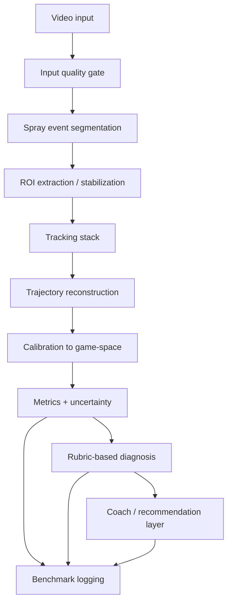

# SDD - Sistema de Analise de Spray

Status: draft tecnico  
Data: 2026-04-13  
Projeto: `sens-pubg`

Companion de execucao:

- `docs/SPRAY-ANALYSIS-EXECUTION-PLAN.md`

## 0. Atualizacao verificada em 2026-04-14

Desde a fotografia inicial deste SDD, a baseline operacional foi rerodada e o primeiro benchmark capturado foi fechado.

Comandos executados nesta rodada de validacao:

```bash
npx vitest run
npm run build
npx playwright test
npm run benchmark
npm run promote:captured-clips
npx tsx scripts/run-benchmark.ts tests/goldens/benchmark/captured-benchmark-draft.json
```

Resultado verificado:

- `npx vitest run`: 53 arquivos e 174 testes passaram
- `npm run build`: passou
- `npx playwright test`: 21 testes passaram
- `npm run benchmark`: benchmark sintetico passou com `2/2` em tracking, diagnostico e coach, sem regressao
- `npm run promote:captured-clips`: promoveu `2` clips capturados e preservou `sprayWindow`
- `npx tsx scripts/run-benchmark.ts tests/goldens/benchmark/captured-benchmark-draft.json`: passou com `2/2` em tracking, diagnostico e coach

Leitura honesta do estado atual:

- o projeto nao esta mais bloqueado por baseline vermelha de build/test/E2E;
- ja existe uma trilha de validacao deterministica para benchmark sintetico e para um draft inicial de clips capturados;
- isso ainda nao significa "100% perfeito": o proximo ganho real de confianca vem de ampliar o corpus capturado e manter a validacao visual/E2E recorrente.

## 1. Resumo executivo

Nao existe base tecnica hoje para afirmar que o sistema de analise de spray esta "100% perfeito".

O que existe hoje e um MVP com boa separacao modular e uma ideia correta de pipeline:

`video -> frames -> tracking -> trajectory -> metrics -> diagnosis -> coaching`

Mas a implementacao atual ainda depende de heuristicas simples, tem inconsistencias entre UI, dominio e pipeline, nao mede incerteza de forma real e nao possui benchmark capaz de sustentar uma garantia forte de qualidade.

Veredito honesto:

- O produto esta em um estagio "promissor, mas nao validado".
- O tracking atual nao e estado da arte.
- O sistema atual nao e "IA" no sentido de modelo aprendido para tracking ou avaliacao de movimento; ele e majoritariamente deterministico e baseado em regras.
- O projeto precisa de uma arquitetura v2, dataset de validacao, metricas de erro, gates de release e regressao automatizada antes de qualquer promessa de precisao total.

Conclusao principal:

> Se o objetivo e confiabilidade real para analise de spray, o caminho certo nao e "colocar um LLM por cima". O caminho certo e elevar o stack de percepcao e calibracao, medir incerteza, criar benchmark estratificado e so depois plugar uma camada de coaching/IA generativa sob restricoes.

## 2. Objetivo deste SDD

Este documento define:

- o estado atual implementado no repositorio;
- os gaps que impedem afirmar confiabilidade total;
- o estado da arte relevante em tracking, video understanding e action quality assessment;
- a arquitetura alvo recomendada para uma versao robusta do sistema;
- o plano de validacao necessario para chamar o sistema de confiavel.

## 3. Escopo do sistema

O sistema pretende:

- receber um clip curto de spray do PUBG;
- identificar o evento de spray;
- rastrear a mira ao longo do tempo;
- transformar o movimento em trajetoria e metricas;
- diagnosticar erros como jitter, overpull, underpull e drift;
- recomendar ajustes de sensibilidade e tecnica;
- persistir resultado historico para comparacao.

## 4. Estado atual implementado

### 4.1 Pipeline atual


### 4.2 Pontos fortes reais

- A separacao por modulos e boa o suficiente para evolucao incremental.
- O projeto ja separa ingestao, extracao, tracking, metricas, diagnostico e coaching.
- A persistencia do resultado completo no historico e util para auditoria futura.
- Existe uma base de testes unitarios para partes do dominio matematico.

### 4.3 Diagnostico tecnico do codigo atual

#### Achado A - o sistema atual nao e IA aprendida

Nao ha dependencia de modelos de visao, tracking neural, pose, segmentation foundation model ou sequence model em `package.json`.

Evidencia:

- `package.json` contem Next/React/Drizzle/Zod/Vitest/Playwright, mas nenhum stack de CV/ML.
- `src/core/diagnostic-engine.ts` e `src/core/sensitivity-engine.ts` operam com regras e thresholds.

Implicacao:

- A UX vende "IA", mas o motor atual e heuristico.
- Isso nao e um problema por si so; o problema e comunicar algo mais forte do que a implementacao entrega.

#### Achado B - o tracking de producao e simples demais para o nivel de confianca desejado

O worker em `src/workers/aimAnalyzer.worker.ts` usa um algoritmo de centroide baseado em cor para localizar o reticulo frame a frame.

Evidencia:

- `findCrosshair(...)` e chamado diretamente no worker.
- Se a mira some, o frame e simplesmente ignorado.
- `confidence` e fixado em `1.0`.
- O calculo de drift esta comentado.

Impacto:

- falha sob oclusao, muzzle flash, compressao, HUDs, motion blur e reticulos nao triviais;
- nao existe calibracao real da confianca;
- um frame detectado com erro pode entrar como se fosse "certeza maxima".

#### Achado C - existe um tracker melhor no repositorio, mas ele nao esta conectado no pipeline principal

`src/core/crosshair-tracking.ts` implementa template matching com score e `trackingQuality`, mas a busca no codigo mostra que `trackCrosshair(...)` so e definido ali e nao e usado no fluxo principal.

Impacto:

- ha divergencia entre a intencao arquitetural e a execucao real;
- o pipeline de producao usa a opcao mais fraca.

#### Achado D - tracking quality e frames lost sao fabricados no acoplamento do worker com o motor

Em `src/app/analyze/analysis-client.tsx`, o resultado do worker e mapeado para a engine com:

- `confidence: 1.0`
- `trackingQuality: 1.0`
- `framesLost: 0`

Impacto:

- qualquer degradacao real do tracking desaparece antes da etapa de metricas;
- o dashboard recebe um retrato artificialmente otimista.

#### Achado E - o tempo esperado do spray esta hardcoded

`analysis-client.tsx` usa:

`const expectedDurationSecs = (30 * 0.086) + 0.5`

Impacto:

- o sistema nao usa plenamente o perfil da arma selecionada;
- clipes com comportamento diferente podem ser cortados ou processados com janela errada;
- a logica nao escala para armas fora do conjunto assumido.

#### Achado F - attachments, scope e distance nao entram de forma coerente na analise

O contexto enviado ao worker inclui `fov`, `resolutionY`, `weapon`, `vsm`, `crosshairColor`, mas:

- a multiplicacao horizontal de attachments esta fixada em `1.0`;
- `scopeId` e `distance` aparecem em UI/persistencia, mas nao entram de forma robusta na matematica central;
- `pixelToDegree` usa default fixo em `calculateSprayMetrics(...)`.

Impacto:

- o sistema aparenta estar calibrado pelo setup completo do jogador, mas parte disso ainda nao influencia de fato o resultado.

#### Achado G - a registry tecnica de armas e menor que o catalogo do banco

`src/game/pubg/weapon-data.ts` registra 15 armas, enquanto o seed do banco contem mais entradas.

Impacto:

- o usuario pode escolher uma arma do banco e cair em erro de resolucao tecnica;
- o dominio de negocio e o dominio matematico nao estao sincronizados.

#### Achado H - a visualizacao promete "ideal pattern", mas nao desenha o ideal pattern

`src/app/analyze/spray-visualization.tsx` descreve comparacao com o padrao ideal, mas `showIdeal` nao materializa uma trilha ideal na renderizacao atual.

Impacto:

- risco de interpretacao enganosa;
- o usuario pode acreditar que houve comparacao com padrao de referencia quando nao houve.

#### Achado I - o contrato de ingestao nao esta alinhado com a mensagem do produto

UI/README dizem 5-15 segundos, mas `src/core/video-ingestion.ts` aceita 3-20 segundos.

Impacto:

- expectativas inconsistentes;
- maior variabilidade de entrada sem explicacao clara.

#### Achado J - a validacao automatizada atual nao prova corretude do sistema

Hoje os testes cobrem principalmente `src/core/**` e `src/game/**`, com foco em funcoes puras.

Faltam:

- testes do worker;
- testes de frame extraction;
- testes de integracao do pipeline completo;
- testes com clips reais rotulados;
- benchmark quantitativo de tracking/diagnostico;
- regressao com goldens.

## 5. Evidencia operacional desta sessao

### 5.1 Testes unitarios

Comando executado:

```bash
npx vitest run
```

Resultado:

- 2 arquivos falharam
- 3 arquivos passaram
- 2 testes falharam
- 31 testes passaram

Falhas observadas:

- `src/core/coach-engine.test.ts`
- `src/core/sensitivity-engine.test.ts`

Interpretacao:

- mesmo a camada de dominio "deterministica" nao esta totalmente verde;
- a suite atual tambem mostra fragilidade entre expectativa de testes e texto retornado.

### 5.2 Build

Comando executado:

```bash
npm run build
```

Resultado nesta sessao:

- falhou em prerender/runtime do Next
- erros envolvendo `/_document` e `./vendor-chunks/next.js`

Interpretacao:

- o sistema nao esta em baseline de release;
- antes de discutir "100% de precisao" na analise, o baseline de entrega precisa estar estavel.

### 5.3 E2E

Comando executado:

```bash
npx playwright test
```

Resultado nesta sessao:

- 4 testes falharam
- 17 testes passaram

Falhas observadas:

- `e2e/a11y.spec.ts` (botoes de login desabilitados/nao focaveis)
- `e2e/pages.spec.ts` (dropzone e links esperados nao encontrados)
- `e2e/responsive.spec.ts` (navegacao esperada nao encontrada)

Interpretacao:

- a trilha de produto completa ainda nao esta estabilizada;
- a camada de experiencia do usuario nao sustenta estado "production ready".

## 6. Por que "100% certeza" e a meta errada

Em sistemas de visao e avaliacao de movimento, "100% perfeito" normalmente nao e uma meta tecnica valida por tres motivos:

- o input e ruidoso: compressao, codec, fps, motion blur, HUD, flash, resolucao, stream overlays;
- o estado do mundo e parcialmente oculto: attachments reais, FOV correto, distancia real, ADS state, perda de frames;
- o problema e parcialmente subjetivo: o diagnostico de tecnica e a recomendacao de coaching exigem interpretacao, nao apenas medicao.

A meta correta e:

- erro medido;
- incerteza calibrada;
- benchmark estratificado;
- regressao automatica;
- release gates quantitativos.

Em outras palavras:

> nao precisamos prometer "certeza absoluta"; precisamos provar "desempenho conhecido, estavel e monitorado".

## 7. Estado da arte relevante

### 7.1 Point tracking / dense correspondence

Os trackers modernos relevantes para este problema abandonaram heuristicas simples como cor + centroide como mecanismo principal de robustez.

Referencias primarias:

- [TAPIR: Tracking Any Point with per-frame Initialization and Temporal Refinement](https://arxiv.org/abs/2306.08637)
- [CoTracker3: Simpler and Better Point Tracking by Pseudo-Labelling Real Videos](https://arxiv.org/abs/2410.11831)
- [AllTracker: Efficient Dense Point Tracking at High Resolution](https://arxiv.org/abs/2506.07310)

O que essas linhas de trabalho trazem:

- rastreamento de pontos arbitrarios, inclusive com oclusao parcial;
- modelagem temporal mais robusta do que matching local simples;
- melhor generalizacao para video real;
- saida de visibilidade/confianca, nao so coordenadas.

Inferencia para este projeto:

- para spray analysis, o centro do problema e "point tracking robusto em video ruidoso";
- um sistema de producao serio precisa ao menos de:
  - tracking com nocao de visibilidade;
  - confidence calibration;
  - suporte a long-range consistency;
  - operacao em resolucao realista.

### 7.2 Video segmentation foundation models

Referencia primaria:

- [SAM 2: Segment Anything in Images and Videos](https://arxiv.org/abs/2408.00714)

O que importa aqui:

- segmentacao/seguimento orientado por prompt;
- memoria temporal para video;
- melhor robustez para objetos/regioes ao longo do tempo.

Inferencia para este projeto:

- SAM 2 nao resolve sozinho o problema de spray analysis;
- mas aponta uma direcao forte para extrair e manter consistencia de ROI/reticulo/arma/HUD em cenas complexas;
- pode ser util como modulo auxiliar de ROI tracking e segmentation, nao necessariamente como o scorer final.

### 7.3 Action Quality Assessment (AQA)

Referencias primarias:

- [FineParser: A Fine-grained Spatio-temporal Action Parser for Human-centric Action Quality Assessment](https://arxiv.org/abs/2405.06887)
- [RICA2: Rubric-Informed, Calibrated Assessment of Actions](https://arxiv.org/abs/2408.02138)
- [A Decade of Action Quality Assessment: Largest Systematic Survey](https://haoyin116.github.io/Survey_of_AQA/static/pdfs/A_Decade_of_AQA.pdf)

O que o estado da arte mostra:

- avaliacao de qualidade de movimento precisa de representacoes finas no tempo;
- interpretabilidade e rubric-based scoring sao importantes;
- calibracao de incerteza e multimodalidade importam em cenarios reais;
- feedback acionavel depende de decompor a acao, nao apenas soltar uma nota global.

Inferencia para este projeto:

- "spray analysis" e um caso especial de AQA orientado por dominio de recoil e mouse control;
- o scoring ideal nao deve ser so uma soma heuristica de erros;
- ele deve ser rubric-informed, por fase temporal do spray e com faixa de confianca.

### 7.4 Limite atual de VLMs/LLMs para julgar movimento fino

Referencia primaria muito relevante:

- [Can Vision Language Models Judge Action Quality? An Empirical Evaluation](https://arxiv.org/abs/2604.08294) - publicado em 2026-04-09

O achado central desse trabalho:

- VLMs atuais ficam apenas marginalmente acima do acaso em varios cenarios de AQA fina;
- adicionar prompting, grounding ou estruturas de reasoning gera ganhos localizados, nao uma solucao robusta.

Implicacao direta para este projeto:

- usar um VLM/LLM como juiz principal da qualidade do spray hoje seria um erro de arquitetura;
- a IA generativa deve entrar como camada de explicacao/coaching sobre metricas robustas, nao como motor primario da medicao.

## 8. Gap analysis: atual vs necessario

| Area | Estado atual | Estado desejado | Gap |
|---|---|---|---|
| Tracking | cor + centroide, confianca fixa | point tracking com visibilidade e confidence | muito alto |
| Calibracao | pixel-to-degree default em partes do pipeline | calibracao consistente por FOV/resolucao/ADS/scope | alto |
| Armas e anexos | catalogo inconsistente, horizontal TODO | dominio unificado e completo | alto |
| Event segmentation | janela hardcoded por spray | segmentacao robusta do burst/spray | medio-alto |
| Scoring | heuristico e sem incerteza calibrada | rubric-informed + uncertainty-aware | alto |
| Feedback | regras fixas | feedback condicionado por evidencia + confianca | medio |
| Validacao | unit tests parciais | benchmark + clips rotulados + E2E + goldens | muito alto |
| Produto | UI promete IA forte | UX alinhada com capacidade real | medio |

## 9. Arquitetura alvo recomendada (v2)

### 9.1 Principio central

Separar claramente:

1. percepcao visual;
2. calibracao fisica/espacial;
3. scoring e diagnostico;
4. coaching gerado.

### 9.2 Arquitetura proposta



### 9.3 Componentes

#### A. Input quality gate

Responsavel por rejeitar ou marcar com baixa confianca clips com:

- fps insuficiente;
- bitrate/compressao ruins;
- reticulo nao detectavel;
- overlays invasivos;
- camera shake ou crop inadequado;
- duracao fora do protocolo.

Saida:

- `quality_score`
- `reject_reason[]`
- `degradation_flags[]`

#### B. Spray event segmentation

Objetivo:

- detectar exatamente onde o spray/burst comeca e termina;
- separar recoil pattern de momentos mortos, reload, transicao de ADS e flicks.

Implementacao recomendada:

- baseline heuristica melhorada por sinais temporais;
- opcionalmente sequence model leve no futuro.

Saida:

- `spray_segments[]`
- `start_error_ci`
- `end_error_ci`

#### C. Tracking stack

Recomendacao pratica:

- manter um tracker classico barato como baseline/fallback;
- adicionar um tracker moderno de pontos para o caminho premium/offline;
- registrar visibilidade, confidence e perda de track.

Estrutura recomendada:

- Tier 1: tracker classico rapido para preview local;
- Tier 2: tracker robusto offline para score definitivo;
- fallback e disagreement detection entre os tiers.

#### D. Trajectory reconstruction

Objetivo:

- reconstruir trajetoria limpa com resampling temporal;
- distinguir movimento legitimo da mira de ruido visual;
- nao "inventar" pontos sem sinal.

Deve incluir:

- smoothing controlado;
- interpolacao limitada e marcada;
- outlier rejection;
- confidence-aware aggregation.

#### E. Calibration to game-space

Talvez o ponto mais critico.

Converter:

- pixels
- frame timestamps
- configuracao do jogador

em:

- deslocamento angular estimado;
- fase do recoil;
- desvio em relacao ao padrao esperado por arma/loadout/stance.

Entradas obrigatorias:

- FOV real;
- resolucao real;
- DPI/eDPI;
- sensitivity profile;
- arma;
- muzzle;
- grip;
- stock;
- stance;
- ADS/scope state;
- opcionalmente distancia e sensibilidade vertical.

Sem essa camada bem feita, o sistema mede "movimento visual no video", nao "controle de recoil do jogador".

#### F. Metrics + uncertainty

As metricas precisam sair com incerteza.

Exemplos:

- tracking coverage
- median point error estimado
- horizontal jitter
- vertical compensation error
- lateral drift
- phase stability
- recoil adherence
- confidence interval por metrica

O sistema nao deve apenas dizer:

- "jitter = 12"

Ele deve dizer algo como:

- "jitter = 12 +/- 3, confianca moderada, clip degradado por blur e perda de track em 7% dos frames"

#### G. Rubric-based diagnosis

Diagnostico nao deve ser um mapeamento opaco.

Deve existir rubrica explicita por fase:

- inicio do spray;
- fase media;
- fase final;
- reset/transicao.

Cada fase deve avaliar:

- estabilidade;
- compensacao vertical;
- controle horizontal;
- consistencia temporal.

#### H. Coach / recommendation layer

A camada generativa pode ser usada aqui, com restricoes.

Regra recomendada:

- o modelo generativo nunca cria metricas;
- o modelo generativo recebe metricas, rubricas, confiancas e exemplos;
- o modelo generativo apenas transforma isso em explicacao, plano de treino e sugestao de ajuste.

## 10. Plano de validacao para confiabilidade real

### 10.1 Benchmark dataset obrigatorio

Sem dataset, nao existe garantia.

O projeto precisa de um conjunto de clips rotulados e estratificados por:

- arma
- attachments
- stance
- FOV
- resolucao
- cor de reticulo
- mapa/cenario
- bitrate/compressao
- fps
- luminosidade/efeitos
- nivel de habilidade do jogador

Idealmente com tres fontes:

- clips reais rotulados manualmente;
- clips sinteticos/controlados;
- clips de regressao historicos do proprio produto.

### 10.2 Labels minimos necessarios

- inicio/fim do spray
- visibilidade da mira por frame
- trajetoria ground truth em subset
- classe de erro dominante
- score rubricado por especialista
- confianca do rotulo humano

### 10.3 Metricas de sistema

#### Percepcao

- visible-frame recall
- track coverage
- median pixel error
- 95th percentile pixel error
- false recovery rate
- confidence calibration error

#### Temporal

- MAE de inicio do spray
- MAE de fim do spray
- phase alignment error

#### Diagnostico

- precision/recall/F1 por classe
- macro-F1
- confusion matrix por arma/loadout

#### Coaching

- agreement com especialistas
- usefulness score por usuario
- actionability score

#### Produto

- build success rate
- e2e success rate
- latency
- retry rate

### 10.4 Release gates recomendados

Exemplo de barra minima para dizer "confiavel para beta serio":

- build: 100% verde
- unit/integration/e2e: 100% verde
- visible-frame recall >= 99% em clips limpos
- visible-frame recall >= 95% em clips degradados aceitos
- median point error <= 2 px em benchmark limpo
- P95 point error <= 5 px em benchmark limpo
- macro-F1 diagnostico >= 0.90 nas classes principais
- ECE de confianca < 0.05
- agreement com avaliacao especialista >= 0.85

Exemplo de barra para dizer "quase production-grade":

- regressao automatica por arma/loadout
- datasets versionados
- benchmark rodado em CI noturna
- monitoramento de drift de performance entre releases

## 11. Roadmap recomendado

### Fase P0 - corrigir baseline de engenharia

Objetivo:

- sistema compilando, testando e com contratos coerentes.

Itens:

- zerar falhas de `vitest`
- zerar falhas de `playwright`
- estabilizar `npm run build`
- alinhar UI/README/ingestao
- unificar catalogo de armas entre banco e engine
- remover claims exageradas de IA ou alinhar a implementacao

### Fase P1 - tornar o tracking honesto e auditavel

Objetivo:

- o sistema passar a expor a qualidade real da percepcao.

Itens:

- conectar `trackingQuality`, `framesLost` e confidence reais ao pipeline
- parar de fixar `confidence = 1.0`
- ativar/avaliar tracker melhor do repositorio ou substitui-lo
- adicionar logging por frame
- criar goldens de tracking

### Fase P2 - calibracao de dominio

Objetivo:

- transformar trajetoria em sinal fisicamente relevante para recoil.

Itens:

- pipeline consistente de FOV/resolucao/pixel-to-degree
- aplicar `scopeId`, `distance`, attachments e stance corretamente
- substituir duracao hardcoded por perfil tecnico da arma

### Fase P3 - benchmark e scoring de verdade

Objetivo:

- sair de heuristica ad hoc para scoring validado.

Itens:

- criar dataset rotulado
- introduzir scoring rubricado por fase
- medir erro e incerteza por arma/loadout
- testar versao probabilistica inspirada em RICA2

### Fase P4 - IA generativa apenas como camada final

Objetivo:

- coaching mais rico, sem comprometer confiabilidade.

Itens:

- gerar feedback textual a partir de metricas e confiancas
- personalizar treino por historico do usuario
- explicar "por que" e "o que fazer" sem inventar medidas

## 12. O que eu faria imediatamente neste repositorio

Prioridade 1:

- consertar build, unit tests e e2e
- unificar armas DB vs engine
- eliminar hardcodes mais perigosos
- propagar `trackingQuality`, `framesLost` e confidence reais

Prioridade 2:

- trocar o tracking simples de producao por stack com fallback e validacao
- criar suite de clips goldens
- revisar claims de "IA" na UX

Prioridade 3:

- definir benchmark de spray
- medir qualidade antes de tentar sofisticar o coach

## 13. Definicao de pronto

Este sistema so deve ser descrito como "confiavel" quando:

- a engenharia base estiver verde;
- o tracking estiver medido, nao presumido;
- a calibracao estiver completa;
- as metricas tiverem incerteza;
- existir benchmark versionado;
- o score superar gates claros por estrato de arma e condicao;
- a camada de coaching respeitar a confianca do motor.

Frase final de governanca tecnica:

> Hoje o sistema nao esta pronto para uma afirmacao de "100% de certeza".  
> Ele esta pronto para uma fase de endurecimento tecnico serio.  
> Se seguirmos a arquitetura v2 e o plano de validacao acima, ai sim teremos base para dizer que a analise de spray e confiavel, auditavel e alinhada ao estado da arte.

## 14. Anexo - arquivos mais relevantes auditados

- `src/app/analyze/analysis-client.tsx`
- `src/workers/aimAnalyzer.worker.ts`
- `src/core/crosshair-tracking.ts`
- `src/core/spray-metrics.ts`
- `src/core/diagnostic-engine.ts`
- `src/core/sensitivity-engine.ts`
- `src/core/coach-engine.ts`
- `src/core/video-ingestion.ts`
- `src/game/pubg/weapon-data.ts`
- `src/db/seed.ts`
- `src/app/analyze/spray-visualization.tsx`
- `vitest.config.ts`
- `playwright.config.ts`
- `package.json`

## 15. Addendum 2026 - especificacao para buscar "perfeicao"

Este adendo sobe o nivel do SDD.

Se a meta nao e "bom o bastante", mas sim "o mais exato possivel", entao o sistema precisa obedecer quatro principios:

1. ser patch-aware;
2. ser projection-aware;
3. ser uncertainty-aware;
4. ser evidence-linked do tracking ate o coach.

Em termos praticos:

> "Perfeicao" aqui nao significa fingir certeza absoluta.  
> Significa modelar corretamente o que e matematica exata, o que e dado oficial versionado por patch, e o que so pode ser obtido por calibracao empirica com erro conhecido.

### 15.1 Fatos oficiais de 2024-2026 que mudam o dominio

Os dados do jogo nao sao estaticos. O proprio PUBG anunciou em 2026 que o gunplay passa a operar como um "constantly flowing ecosystem", com meta rotations a cada quatro meses e balance updates a cada dois meses.

Referencias oficiais:

- [PUBG: BATTLEGROUNDS 2026 Roadmap](https://pubg.com/en/news/9855) - anuncio em 2026-03-23
- [Patch Notes - Update 41.1](https://pubg.com/en/news/9926) - publicado em 2026-04-08
- [Patch Notes - Update 36.1](https://pubg.com/en/news/8725) - publicado em 2025-06-11
- [Patch Notes - Update 35.1](https://pubg.com/en/news/8476) - publicado em 2025-04-08
- [Patch Notes - Update 31.1](https://pubg.com/en/news/7582) - publicado em 2024-08-06
- [Patch Notes - Update 19.2](https://pubg.com/en/news/1734) - introducao oficial do Heavy Stock

Tabela de impacto direto no sistema:

| Data | Update | Fato oficial | Impacto no sistema |
|---|---|---|---|
| 2024-08-06 | 31.1 | Muzzle Brake adicionado com `+10% vertical`, `+10% horizontal`, `+50% camera shake control`; Thumb Grip sobe para `+10% vertical`; Angled vai para `+25% horizontal`; Heavy Stock sobe para `+10% vertical` e `+10% horizontal` | recoil nao pode ser modelado com uma tabela fixa de 2022/2023 |
| 2025-04-08 | 35.1 | novo sistema de aim punch para todas as armas, com comportamento por categoria e reducao por distancia | tracking de video precisa separar recoil proprio de perturbacao externa |
| 2025-06-11 | 36.1 | Muzzle Brake tem vertical ajustado `+8% -> +10%`; VSS recebe zeroing novo; spawns de armas mudam | attachment profiles e weapon availability precisam de patchVersion |
| 2026-03-23 | Roadmap 2026 | major meta updates a cada 4 meses, balance updates a cada 2 meses, Hybrid Scope e Tilted Grip em abril, arma nova em agosto, remocao de armas em junho | hardcode estatico de arma/attachment deixa de ser aceitavel |
| 2026-04-08 | 41.1 | Hybrid Scope adicionado; Tilted Grip adicionado com `+12% vertical`, `+6% horizontal`, `+25% camera shake control`; Half Grip horizontal `+8% -> +16%`; Angled Foregrip removido do world spawn | optics e grips precisam refletir estado 2026 imediatamente |
| 2026-04-08 | 41.1 | nota oficial de remocao futura na 42.1 de Mosin Nagant, R45, DP-28, PP-19 Bizon, P1911 e QBU | catalogo precisa suportar `valid_from`, `valid_to` e estados "deprecated"/"removed" |

Implicacao central:

> Um sistema "perfeito" para spray analysis em PUBG nao pode depender de dicionarios estaticos.  
> Ele precisa ser governado por um catalogo canonico versionado por patch.

### 15.2 Onde o repositorio esta desatualizado para 2026

Pontos criticos encontrados:

- `src/game/pubg/scope-multipliers.ts` nao possui Hybrid Scope, apesar de ele ter sido oficialmente introduzido na 41.1.
- `src/app/profile/profile-wizard.tsx` so coleta `red-dot`, `2x`, `3x`, `4x`, `6x` e `8x`; nao cobre Hybrid Scope nem 15x.
- `src/db/schema.ts` modela `analysis_sessions.attachments` apenas como `{ muzzle, grip, stock }`, sem `optic`, sem `zoom_state`, sem `patchVersion`.
- `src/db/schema.ts` modela `weapon_profiles.multipliers` com chaves limitadas (`muzzle_brake`, `compensator`, `heavy_stock`, `vertical_grip`, `half_grip`), incapaz de representar Tilted Grip, Thumb Grip, Lightweight Grip, Laser Sight, Hybrid Scope, etc.
- `src/core/coach-engine.ts` ainda recomenda `Angled Grip`, embora a 41.1 tenha removido o Angled Foregrip do world spawn.
- `src/core/sensitivity-engine.ts` ainda produz recomendacao de sens principalmente por faixa heuristica de playstyle/grip, em vez de um modelo fisico patch-aware.

Conclusao:

> Mesmo que o tracking ficasse excelente hoje, o dominio 2026 do jogo ainda nao esta representado com fidelidade suficiente no backend nem no coach.

### 15.3 Modelo de dados canonico 2026

Para a matematica e o coach ficarem corretos "considerando tudo", o dominio precisa ser reestruturado assim:

#### Entidades obrigatorias

1. `game_builds`

- `patch_version` ex: `41.1`
- `release_date`
- `valid_from`
- `valid_to`
- `notes_url`

2. `weapon_patch_profiles`

- `weapon_id`
- `patch_version`
- `fire_mode`
- `rpm`
- `muzzle_velocity`
- `recoil_pattern_vertical[]`
- `recoil_pattern_horizontal_distribution`
- `camera_shake_profile`
- `recovery_profile`
- `aim_punch_profile`
- `zeroing_profile`

3. `attachment_catalog`

- `attachment_id`
- `slot` (`optic`, `muzzle`, `grip`, `stock`, `mag`, `cheekpad`, `special`)
- `patch_version`
- `available_from`
- `available_to`
- `spawn_state` (`world_spawn`, `care_package`, `removed`, `event_only`)
- `compatibility_rules`

4. `attachment_effect_profiles`

- `attachment_id`
- `patch_version`
- `vertical_recoil_mult`
- `horizontal_recoil_mult`
- `camera_shake_mult`
- `recovery_mult`
- `ads_speed_mult`
- `hipfire_mult`
- `first_shot_mult`
- `muzzle_rise_mult`
- `sway_breathing_mult`

5. `optic_profiles`

- `optic_id`
- `patch_version`
- `native_magnification_states[]`
- `native_sensitivity_multiplier`
- `fov_reduction`
- `toggle_states`

Exemplo:

- `red-dot` -> estado unico `1x`
- `hybrid-scope` -> estados `hybrid_1x` e `hybrid_4x`

6. `analysis_context`

- `patch_version`
- `weapon_id`
- `optic_id`
- `optic_state_timeline`
- `attachments`
- `stance_timeline`
- `movement_state_timeline`
- `fov`
- `resolution_width`
- `resolution_height`
- `aspect_ratio`
- `general_sens`
- `ads_sens`
- `scope_sens`
- `vertical_multiplier`
- `dpi`
- `polling_rate`
- `distance_m`

Sem isso, o sistema continua "generalista". Com isso, ele passa a ser um sistema de analise realmente governado pelo estado do jogo.

### 15.4 Especificacao matematica de verdade

Esta secao define como a matematica deve ser tratada num sistema "perfection-grade".

#### 15.4.1 Regra de ouro

Dividir o problema em tres classes:

- matematica exata: geometria de projecao, conversao trigonometrica, algebra de combinacao;
- matematica patch-calibrada: coeficientes nativos do jogo e perfis de attachment/optic;
- matematica empirica com erro medido: tudo que o jogo nao publica oficialmente e precisa ser inferido em laboratorio.

#### 15.4.2 Estado observado no video

O video nao observa "input do mouse". Ele observa o resultado liquido de varios fatores:

```text
net_view_motion(t) =
    weapon_recoil(t)
  + camera_shake(t)
  + aim_punch(t)
  + target_tracking_motion(t)
  - player_mouse_compensation(t)
  + tracking_noise(t)
```

Esse e o ponto mais importante do SDD inteiro.

Se o sistema nao separar esses termos, ele vai confundir:

- recoil da arma;
- shake visual;
- perturbacao externa por aim punch;
- movimento voluntario do jogador;
- erro do proprio tracker.

#### 15.4.3 Transformacao exata de pixel para angulo

O repositorio hoje usa aproximacoes lineares do tipo `graus por pixel`.

Para chegar perto do "perfeito", isso precisa ser trocado pela inversao correta da projecao em perspectiva.

Definicoes:

```text
W = largura do frame em pixels
H = altura do frame em pixels
cx = W / 2
cy = H / 2
fov_h = FOV horizontal efetivo no estado atual
aspect = W / H
fov_v = 2 * atan( tan(fov_h / 2) / aspect )
```

Para um ponto rastreado `(x, y)`:

```text
ang_x(x) = atan( ((2 * (x - cx)) / W) * tan(fov_h / 2) )
ang_y(y) = atan( ((2 * (cy - y)) / H) * tan(fov_v / 2) )
```

Entre frames consecutivos:

```text
delta_theta_x(t) = ang_x(x_t) - ang_x(x_t-1)
delta_theta_y(t) = ang_y(y_t) - ang_y(y_t-1)
```

Isto e melhor do que:

- `pixelsPerDegree = width / fov`
- `degPerPx = fov / width`

porque essas formas sao apenas aproximacoes locais e erram mais longe do centro da tela.

#### 15.4.4 Sensibilidade efetiva

O modelo atual do repositorio usa:

```text
phi(slider) = 10 ^ ((slider - 50) / 50)
```

e:

```text
internal_effective =
    phi(general_slider)
  * phi(ads_slider)
  * native_scope_multiplier(scope, patch)
  * phi(scope_slider)
```

Esse modelo deve ser tratado como:

- `candidate_live_formula_v1`, e nao como verdade absoluta;
- validado por patch em laboratorio.

Para um sistema realmente exato, a especificacao deve permitir:

```text
phi_patch(slider, patch)
k_yaw(patch)
k_pitch(patch)
native_scope_multiplier(scope, optic_state, patch)
```

e calcular:

```text
effective_yaw =
    k_yaw(patch)
  * phi_patch(general_slider, patch)
  * phi_patch(ads_slider, patch)
  * native_scope_multiplier(scope, optic_state, patch)
  * phi_patch(scope_slider, patch)

effective_pitch =
    k_pitch(patch)
  * phi_patch(general_slider, patch)
  * phi_patch(ads_slider, patch)
  * native_scope_multiplier(scope, optic_state, patch)
  * phi_patch(scope_slider, patch)
  * vertical_multiplier
```

Se o jogo for isotropico em yaw/pitch fora do VSM, entao `k_yaw = k_pitch`.
Se nao for, isso precisa ser medido e versionado.

#### 15.4.5 cm/360, counts e recomendacao de sens

O objetivo da recomendacao de sens nao deve ser "encaixar o jogador numa faixa de arm/wrist".

O objetivo deve ser:

- estimar qual `effective_yaw` e `effective_pitch` minimizam o erro residual por fase do spray;
- respeitar espaco fisico do mousepad;
- respeitar a capacidade do jogador de fazer 180 e microajuste.

Conversoes:

```text
cm_per_360 = (360 * 2.54) / (dpi * effective_yaw)
```

e o inverso:

```text
effective_yaw_target = (360 * 2.54) / (dpi * cm_per_360_target)
```

Mas o alvo nao deve nascer de uma heuristica fixa. Ele deve nascer de uma funcao objetivo.

Exemplo de objetivo:

```text
argmin_sens J =
    w1 * mean_abs(vertical_residual_norm)
  + w2 * mean_abs(horizontal_residual_norm)
  + w3 * jitter_penalty
  + w4 * pad_violation_penalty
  + w5 * adaptation_cost
```

onde:

- `vertical_residual_norm` mede o erro vertical residual normalizado por fase;
- `horizontal_residual_norm` mede o erro lateral residual normalizado;
- `jitter_penalty` penaliza instabilidade fina;
- `pad_violation_penalty` impede recomendacoes inviaveis fisicamente;
- `adaptation_cost` evita microajustes absurdos sem ganho real.

#### 15.4.6 Modelo de recoil esperado

Cada arma precisa ser modelada como uma sequencia de eventos por bala, nao como um unico escalar.

Para cada tiro `n`:

```text
R_n =
    BaseWeaponPattern_n(weapon, patch)
  x MuzzleEffect(patch, muzzle)
  x GripEffect(patch, grip)
  x StockEffect(patch, stock)
  x StanceEffect(stance)
  x MovementEffect(move_state)
  x OpticStateEffect(scope, optic_state)
```

O vetor minimo precisa conter:

```text
R_n = {
  recoil_vertical_deg,
  recoil_horizontal_mean_deg,
  recoil_horizontal_sigma_deg,
  camera_shake_deg,
  recovery_time_ms
}
```

Por que isso e obrigatorio:

- Muzzle Brake, Tilted Grip e Heavy Stock afetam mais de uma dimensao;
- a 41.1 mudou Half Grip;
- a 35.1 mudou aim punch;
- o sistema nao pode reduzir tudo a um unico `baseVerticalRecoil` e um unico `baseHorizontalRng`.

#### 15.4.7 Distancia precisa entrar na severidade

`distance` hoje quase nao participa do motor.

Isso esta errado.

Mesmo erro angular tem impactos praticos diferentes dependendo da distancia.

Conversao:

```text
miss_cm(distance_m, delta_theta_rad) =
    100 * distance_m * tan(abs(delta_theta_rad))
```

Logo:

- a 15m, um erro pequeno pode ser irrelevante;
- a 80m, o mesmo erro pode tirar a rajada inteira do torso.

O diagnostico e o coach devem usar tanto:

- erro angular;
- erro linear na distancia informada.

#### 15.4.8 Hybrid Scope e estado otico por frame

A 41.1 adicionou o Hybrid Scope com alternancia entre `1x` e `4x`.

Isso torna a analise por `scopeId` estatico insuficiente.

Agora o motor precisa inferir `optic_state_timeline(t)`.

Estados minimos:

```text
hip
red_dot_1x
scope_2x
scope_3x
scope_4x
scope_6x
scope_8x
scope_15x
hybrid_1x
hybrid_4x
```

E o calculo de FOV/sensibilidade efetiva precisa trocar dinamicamente conforme o estado do frame.

#### 15.4.9 Aim punch e camera shake precisam ser explicitamente modelados

Depois da 35.1, aim punch deixou de ser um ruido "informal". Ele virou parte oficial do ecossistema de gunplay.

A 31.1 e a 41.1 tambem reforcam que attachments mexem em camera shake.

Portanto, o sistema precisa separar:

- `recoil_true`
- `camera_shake_visual`
- `aim_punch_external`

Se isso nao acontecer, o sistema vai punir o jogador por perturbacoes que nao sao falha de controle.

#### 15.4.10 Confianca propagada de ponta a ponta

Cada frame precisa carregar:

```text
frame_confidence(t) =
    visibility_conf(t)
  * tracker_conf(t)
  * input_quality_conf(t)
  * optic_state_conf(t)
  * exogenous_disturbance_conf(t)
```

E cada metrica precisa herdar isso:

```text
metric_confidence =
    weighted_aggregate(frame_confidence over relevant frames)
```

Nao pode mais existir:

- `confidence = 1.0`
- `trackingQuality = 1.0`
- `framesLost = 0`

quando isso nao for verdade.

### 15.5 Especificacao do coach para 2026

Um coach "perfeito" nao pode ser so eloquente. Ele precisa ser factualmente correto, patch-aware e limitado pela confianca da analise.

Contrato obrigatorio do coach:

1. cada recomendacao deve citar quais metricas e fases a suportam;
2. cada recomendacao deve respeitar `patchVersion`;
3. cada recomendacao deve respeitar o inventario real de attachments do patch;
4. se a confianca estiver baixa, o coach deve admitir isso e reduzir a agressividade das conclusoes;
5. o coach deve separar:
   - `evidence`
   - `hypothesis`
   - `action`
   - `verification plan`

Exemplo do que o coach nao pode mais fazer:

- recomendar Angled Foregrip em sessoes de patch `41.1+`
- recomendar ajuste de sens como se o problema fosse mecanico quando o tracking estiver degradado
- recomendar VSM sem mostrar a fase do spray que gerou essa sugestao

Formato recomendado:

```text
Problem:
Evidence:
Confidence:
Likely cause:
Recommended adjustment:
Recommended attachment/loadout change:
Training drill:
What to verify in next clip:
```

### 15.6 Protocolo de laboratorio para fechar a matematica

Alguns coeficientes podem ser exatos em algebra, mas so ficam confiaveis quando calibrados contra o jogo vivo.

Protocolo recomendado por patch:

1. capturar rotacoes controladas em Training Mode
2. medir `cm/360` real para combinacoes de DPI/sliders
3. medir `FOV efetivo` e `optic_state` por scope
4. medir padrao de recoil por bala para cada arma/meta relevante
5. medir efeito de cada attachment nas dimensoes:
   - vertical recoil
   - horizontal recoil
   - camera shake
   - recovery
   - ADS speed
6. validar por no minimo 30 repeticoes por configuracao
7. publicar `error bars` por patch

Saida obrigatoria:

- `patch calibration report`
- `weapon/attachment coefficient bundle`
- `benchmark delta vs patch anterior`

### 15.7 Requisitos adicionais para este repositorio

Para o projeto atual suportar essa visao, eu exigiria as seguintes mudancas de arquitetura:

1. adicionar `patchVersion` em toda sessao de analise;
2. criar catalogo versionado de armas, optics e attachments;
3. reescrever `scope-multipliers.ts` para suportar `optic_state`;
4. reescrever `sensitivity-engine.ts` para usar funcao objetivo baseada em residual real, nao faixa heuristica;
5. reescrever o worker para expor confianca real;
6. substituir conversao linear `pixel -> grau` por inversao de perspectiva;
7. introduzir `camera_shake` e `aim_punch` como perturbacoes explicitamente modeladas;
8. reescrever o coach para usar metricas + confianca + patch.

### 15.8 Barra minima para dizer "agora sim esta quase perfeito"

Eu so aceitaria essa linguagem quando todas as condicoes abaixo fossem verdade:

- o patch atual do PUBG estiver espelhado no catalogo do sistema em ate 48h;
- nenhuma recomendacao usar attachment removido ou estatistica de patch antigo;
- Hybrid Scope e outros optics dinamicos forem tratados por estado;
- o erro angular e o erro linear por distancia forem ambos medidos;
- o tracker tiver benchmark por arma/mapa/codec/FOV;
- a recomendacao de sens vier de otimizacao fisica, nao heuristica de estilo;
- o coach estiver limitado por confianca e por patch.

Frase final deste adendo:

> O caminho para "perfeicao" nao e adicionar mais texto bonito ao coach.  
> E transformar o sistema num motor patch-aware, matematicamente rigoroso, calibrado por laboratorio e auditavel por benchmark.  
> So depois disso a camada de IA pode ser chamada de premium. Antes disso, ela e apenas cosmetica.
