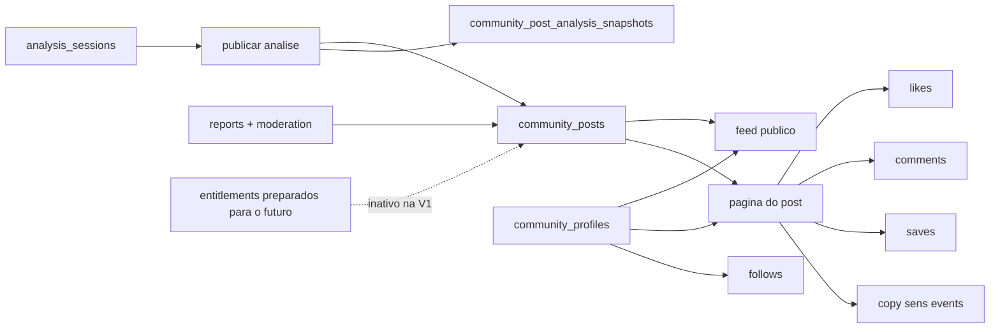

# SDD - Sistema de Comunidade

Status: draft tecnico
Data: 2026-04-15
Projeto: `sens-pubg`

Companion de execucao:

- `docs/COMMUNITY-EXECUTION-PLAN.md`

## 0. Relacao com o produto atual

Este SDD define a comunidade como extensao nativa do produto atual.

Ela nao nasce como "rede social generica". Ela nasce como camada publica e colaborativa em cima de tres ativos que o projeto ja possui:

- analise tecnica de spray;
- perfil tecnico do jogador;
- historico de evolucao e recomendacao de sens.

Isso significa que a comunidade precisa aproveitar, e nao competir com, o dominio atual do repositorio:

- `analysis_sessions` como origem de publicacoes tecnicas;
- `player_profiles` como base do perfil publico;
- `users.role`, `audit_logs` e `system_settings` como base de moderacao e governanca;
- App Router, Server Actions, Drizzle e Neon como stack principal.

Tambem fica travado desde agora:

- nenhuma implementacao de pagamento sera feita nesta fase de documentacao;
- a comunidade precisa nascer preparada para monetizacao futura;
- essa preparacao deve existir no dominio e nos contratos, nao em hacks de UI;
- o visual e a UX devem seguir o padrao atual do projeto.

## 1. Resumo executivo

A comunidade deve ser desenhada como um sistema de publicacao, descoberta e interacao orientado por analises reais de PUBG.

O centro do produto nao sera "postar qualquer coisa". O centro sera:

`analise publicada -> setup copiavel -> feedback da comunidade -> evolucao do jogador`

Veredito arquitetural:

- a V1 deve ser gratuita, simples e totalmente suportada pela infraestrutura ja existente;
- toda persistencia deve ficar no banco atual;
- a V1 nao deve exigir storage de video, busca paga, fila paga, realtime pago ou servicos externos;
- a V1 deve nascer com pontos de extensao para monetizacao futura, mas com tudo desligado por padrao;
- a monetizacao futura deve ser adicionada depois via SDD proprio, sem exigir refatoracao estrutural caotica.

Conclusao principal:

> A comunidade correta para `sens-pubg` e uma comunidade tecnica de analise e setup, nao um feed social generico. O design deve maximizar utilidade, auditabilidade e evolucao, e so depois abrir espaco para monetizacao.

## 2. Objetivo deste SDD

Este documento define:

- a visao de produto da comunidade;
- o escopo inicial e os nao-objetivos;
- a arquitetura alvo alinhada ao projeto atual;
- o modelo de dados recomendado;
- as regras de acesso, moderacao e persistencia;
- a preparacao obrigatoria para monetizacao futura;
- as fases de rollout;
- a doutrina de TDD e validacao para implementacao futura.

## 3. Entendimento confirmado

### 3.1 O que esta sendo construido

Um sistema de comunidade completo dentro do `sens-pubg`, com publicacao de analises, setup/sens copiavel, curtidas, comentarios, feed, descoberta e moderacao.

### 3.2 Por que isso existe

Para transformar o motor de analise em loop comunitario de aprendizado, prova social, descoberta de setups e retencao.

### 3.3 Para quem isso existe

- jogadores que querem publicar sua analise;
- jogadores que querem copiar setups e comparar resultados;
- membros que querem comentar e dar coaching;
- administradores que precisam moderar e manter qualidade;
- no futuro, criadores e membros premium.

### 3.4 Restricoes travadas

- seguir o visual e UX atuais;
- nao quebrar fluxos existentes;
- persistir tudo no banco atual;
- zero dependencia paga nova;
- monetizacao apenas preparada, nao ativada;
- rollout atomico por fases;
- TDD forte e validacao objetiva.

### 3.5 Nao-objetivos da V1

- chat em tempo real;
- DM entre usuarios;
- upload de video comunitario;
- editor de video;
- clans, guildas ou sistema competitivo complexo;
- integracao com gateway de pagamento;
- algoritmo sofisticado de recomendacao dependente de infraestrutura externa.

## 4. Principios de produto

### 4.1 Comunidade orientada por utilidade

Cada feature da comunidade deve responder a pelo menos uma pergunta util:

- "o que esse jogador realmente usou?"
- "essa analise veio de resultado real?"
- "posso copiar esse setup?"
- "essa dica foi util?"
- "como eu descubro exemplos parecidos com meu problema?"

### 4.2 Verdade tecnica acima de hype

O feed nao deve fingir que um post e "analise verificada" se ele nao vier de sessao real.

Por isso o sistema deve diferenciar:

- post derivado de analise real;
- post manual de setup;
- post comparativo;
- conteudo futuro premium ou editorial.

### 4.3 Snapshot imutavel como unidade de confianca

Uma publicacao derivada de analise precisa salvar um snapshot tecnico do estado da analise no momento da publicacao.

Ela nao pode depender apenas de join dinamico com a sessao original, porque:

- a sessao pode ser alterada ou removida;
- o produto pode evoluir o formato do resultado;
- o post precisa continuar legivel e auditavel no futuro.

### 4.4 Zero custo incremental obrigatorio na V1

Para manter custo zero adicional:

- nao havera upload de video novo para a comunidade;
- nao havera storage de imagem pago;
- nao havera busca terceirizada;
- nao havera websocket ou realtime obrigatorio;
- o ranking inicial sera suportado por consultas e indices no Postgres.

### 4.5 Monetizacao preparada, mas inativa

A comunidade precisa nascer com:

- fronteira de entitlement;
- politicas de acesso por post;
- espaco para creator program;
- espaco para destaque/featured content;
- espaco para analytics de criador;

mas sem:

- checkout;
- price ids;
- cobranca;
- dependencia de provedor de pagamento.

## 5. Escopo funcional

## 5.1 Escopo V1 obrigatorio

- publicacao de analise a partir do historico;
- pagina publica de feed;
- pagina publica do post;
- botao de copiar sens;
- curtidas;
- comentarios simples;
- salvar post;
- seguir usuario;
- filtros por arma, patch, tipo de diagnostico e ordenacao;
- moderacao basica;
- persistencia completa em banco.

## 5.2 Escopo V1 recomendado

- perfis publicos de criador/jogador;
- tags derivadas do snapshot tecnico;
- eventos de copia de sens para ranking e analytics futuros de creator;
- comparacao "antes vs depois" como tipo de post posterior a publicacao simples.

## 5.3 Escopo futuro esperado

- recursos premium de descoberta;
- recursos premium de criador;
- conteudo destacado;
- analytics avancado por post;
- colecoes privadas;
- gated content;
- impulsionamento ou destaque pago;
- marketplace ou creator monetization.

## 6. Arquitetura alvo

### 6.1 Visao geral



### 6.2 Alinhamento com o stack atual

O sistema deve seguir o padrao ja usado no repositorio:

- paginas em `src/app/community/**`;
- Server Actions autenticadas em `src/actions/**`;
- regras de negocio puras em `src/core/**`;
- schema e migracoes em `src/db/**` + `drizzle/**`;
- tipos de contrato em `src/types/**`;
- componentes de UI consistentes com `Header`, `glass-card`, tokens e paginas atuais.

### 6.3 Fronteiras recomendadas

#### Camada de apresentacao

- feed;
- detalhe do post;
- perfis publicos;
- pontos de entrada em historico e profile;
- surfaces admin de moderacao.

#### Camada de aplicacao

- publicar analise;
- curtir/descurtir;
- salvar/remover salvo;
- comentar;
- seguir/deixar de seguir;
- reportar;
- moderar;
- resolver entitlements futuros.

#### Camada de dominio

- snapshot de analise;
- politica de visibilidade;
- ranking basico;
- regras de acesso;
- contratos de copy sens;
- guardrails de moderacao.

#### Camada de dados

- tabelas comunitarias;
- indices de feed;
- relacoes com usuarios e analises;
- registros privados de save/copy/report;
- cache leve ou agregados opcionais no proprio banco.

## 7. Modelo de dados recomendado

## 7.1 Tabelas existentes reaproveitadas

- `users`
- `player_profiles`
- `analysis_sessions`
- `audit_logs`
- `system_settings`

## 7.2 Novas tabelas recomendadas

### community_profiles

Finalidade:

- separar identidade publica da identidade interna;
- permitir slug publico;
- sustentar creator program e analytics futuros.

Campos recomendados:

- `id`
- `userId` unique fk -> `users.id`
- `slug` unique
- `displayName`
- `headline`
- `bio`
- `avatarUrl`
- `links` jsonb
- `visibility` enum: `public | hidden`
- `creatorProgramStatus` enum: `none | waitlist | approved | suspended`
- `createdAt`
- `updatedAt`

### community_posts

Finalidade:

- tabela principal do conteudo.

Campos recomendados:

- `id`
- `authorId` fk -> `users.id`
- `communityProfileId` fk -> `community_profiles.id`
- `slug` unique
- `type` enum: `analysis_snapshot | setup_note | comparison`
- `status` enum: `draft | published | hidden | archived | deleted`
- `visibility` enum: `public | unlisted | followers_only | premium_future`
- `title`
- `excerpt`
- `bodyMarkdown`
- `sourceAnalysisSessionId` nullable fk -> `analysis_sessions.id`
- `primaryWeaponId`
- `primaryPatchVersion`
- `primaryDiagnosisKey`
- `copySensPreset` jsonb
- `requiredEntitlementKey` nullable
- `featuredUntil` nullable timestamp
- `publishedAt` nullable timestamp
- `createdAt`
- `updatedAt`

Observacao:

- `requiredEntitlementKey` deve existir desde o modelo, mas ficar `null` em toda a V1.

### community_post_analysis_snapshots

Finalidade:

- preservar o snapshot tecnico imutavel que sustenta um post derivado de analise.

Campos recomendados:

- `postId` pk/fk -> `community_posts.id`
- `analysisSessionId` fk -> `analysis_sessions.id`
- `patchVersion`
- `weaponId`
- `scopeId`
- `distance`
- `stance`
- `attachmentsSnapshot` jsonb
- `metricsSnapshot` jsonb
- `diagnosesSnapshot` jsonb
- `coachingSnapshot` jsonb
- `sensSnapshot` jsonb
- `trackingSnapshot` jsonb
- `analysisResultSchemaVersion`
- `createdAt`

Decisao importante:

- o post publico le do snapshot;
- a referencia para `analysisSessionId` serve para auditoria e navegacao do autor;
- o snapshot evita post quebrado caso o resultado original mude.

### community_post_likes

Campos recomendados:

- `postId`
- `userId`
- `createdAt`

Constraint:

- unique composto em `postId + userId`.

### community_post_saves

Finalidade:

- salvar conteudo de forma privada.

Campos recomendados:

- `postId`
- `userId`
- `createdAt`

Constraint:

- unique composto em `postId + userId`.

### community_post_copy_events

Finalidade:

- registrar uso real do botao de copiar sens;
- apoiar ranking e analytics futuros;
- preparar creator monetization sem custo novo.

Campos recomendados:

- `id`
- `postId`
- `copiedByUserId` nullable
- `copyTarget` enum: `clipboard | profile_draft | preset`
- `createdAt`

### community_post_comments

Finalidade:

- comentarios simples e baratos na V1.

Campos recomendados:

- `id`
- `postId`
- `authorId`
- `status` enum: `visible | author_deleted | moderator_hidden`
- `bodyMarkdown`
- `diagnosisContextKey` nullable
- `createdAt`
- `updatedAt`

Decisao importante:

- V1 com comentarios planos;
- replies ficam para fase futura.

### community_follows

Campos recomendados:

- `followerUserId`
- `followedUserId`
- `createdAt`

Constraint:

- unique composto em `followerUserId + followedUserId`.

### community_reports

Finalidade:

- moderacao basica desde o primeiro release publico.

Campos recomendados:

- `id`
- `entityType` enum: `post | comment | profile`
- `entityId`
- `reportedByUserId`
- `reasonKey`
- `details`
- `status` enum: `open | reviewed | dismissed | actioned`
- `createdAt`
- `reviewedAt`
- `reviewedByUserId` nullable

### community_moderation_actions

Finalidade:

- trilha auditavel por entidade, sem depender apenas do `audit_logs` generico.

Campos recomendados:

- `id`
- `entityType`
- `entityId`
- `actionKey`
- `actorUserId`
- `notes`
- `metadata` jsonb
- `createdAt`

### feature_entitlements

Finalidade:

- catalogo de chaves de acesso futuras.

Status esperado:

- pode existir desde cedo ou ser reservado no SDD;
- mesmo que implementado depois, o dominio deve ser desenhado considerando essa fronteira.

Campos recomendados:

- `key`
- `description`
- `status` enum: `inactive | active`
- `createdAt`

### user_entitlements

Finalidade:

- mapa futuro de recursos por usuario.

Status esperado:

- inativo na V1;
- desenhado desde agora para evitar acoplamento futuro.

Campos recomendados:

- `userId`
- `entitlementKey`
- `source` enum: `manual | subscription_future | creator_program_future`
- `expiresAt` nullable
- `createdAt`

## 7.3 Indices obrigatorios

Para manter custo zero e feed eficiente no Postgres:

- indice por `community_posts(status, visibility, publishedAt desc)`;
- indice por `community_posts(primaryWeaponId, publishedAt desc)`;
- indice por `community_posts(primaryPatchVersion, publishedAt desc)`;
- indice por `community_posts(primaryDiagnosisKey, publishedAt desc)`;
- indice por `community_posts(authorId, publishedAt desc)`;
- indice por `community_post_comments(postId, createdAt asc)`;
- indice por `community_post_copy_events(postId, createdAt desc)`;
- indice por `community_reports(status, createdAt asc)`.

Busca textual futura pode usar recursos nativos do Postgres antes de qualquer servico externo.

## 8. Fluxos principais

## 8.1 Publicar analise

Fluxo:

1. usuario abre uma analise existente no historico;
2. escolhe "publicar na comunidade";
3. sistema cria snapshot imutavel da analise;
4. usuario ajusta titulo, resumo e visibilidade;
5. sistema publica post;
6. feed passa a indexar o conteudo.

Regra obrigatoria:

- publicacao derivada de analise deve salvar o snapshot tecnico no ato de publicar.

## 8.2 Copiar sens

Fluxo:

1. usuario abre post;
2. aciona `copiar sens`;
3. sistema registra `community_post_copy_events`;
4. opcionalmente permite aplicar no draft do proprio perfil no futuro.

Regra obrigatoria:

- o evento de copia e persistido;
- o preset copiado e derivado do snapshot do post, nao de leitura mutavel posterior.

## 8.3 Curtir

Fluxo simples de toggle com unique constraint.

## 8.4 Comentar

Fluxo simples:

1. usuario autenticado comenta;
2. comentario entra visivel por padrao;
3. comentarios podem ser ocultados por moderacao.

## 8.5 Salvar

Fluxo privado, sem efeito publico direto.

## 8.6 Seguir usuario

Serve para:

- futura aba "seguindo";
- creator graph;
- base de monetizacao futura.

## 9. Feed, descoberta e ranking

## 9.1 Regra de feed inicial

V1 deve priorizar simplicidade e previsibilidade:

- feed principal por `publishedAt desc`;
- filtros explicitos;
- ordenacao secundaria opcional por `mais curtidos` ou `mais copiados`;
- sem recomendacao opaca dependente de ML ou infraestrutura externa.

## 9.2 Sinais de ranking permitidos na V1

- recencia;
- likes;
- comments count;
- saves count privado para usuario, nao para ranking publico se nao desejado;
- copy sens count;
- relacao com arma/patch/diagnostico filtrado.

## 9.3 Sinais proibidos na V1

- score secreto;
- boost manual invisivel;
- algoritmo externo nao auditavel;
- dependencia de provider de search/ranking pago.

## 10. UX e consistencia visual

## 10.1 Principio visual

A comunidade deve parecer parte do produto atual.

Isso implica:

- reutilizar `Header` e navegacao existente;
- manter ritmo visual de cards, hero, sections e estados de loading;
- preservar linguagem de produto tecnico;
- evitar uma sub-interface com identidade desconectada.

## 10.2 Entrada de navegacao recomendada

Rotas futuras:

- `/community`
- `/community/[slug]`
- `/community/users/[slug]`
- `/community/me`

Pontos de entrada recomendados:

- header principal;
- pagina de historico;
- pagina de detalhe da analise;
- perfil publico.

## 10.3 Regras de UX

- leitura publica deve ser possivel sem login;
- criar post, curtir, comentar, salvar e seguir exigem login;
- botao de publicar analise deve nascer perto do historico, nao escondido em admin;
- copy sens deve ser visivel, mas nunca enganar sobre origem do preset;
- posts tecnicos devem expor patch, arma, scope e diagnostico com honestidade.

## 11. Moderacao e seguranca

## 11.1 Moderacao minima obrigatoria

- report de post, comentario e perfil;
- estados de ocultacao;
- trilha de moderacao persistida;
- integracao com `audit_logs`;
- rate limiting de acoes sensiveis;
- protecao contra spam basico.

## 11.2 Regras de abuso desde o inicio

- limitar criacao de posts por janela;
- limitar comentarios por janela;
- limitar toggle agressivo de likes/follows;
- bloquear markdown perigoso ou HTML arbitrario;
- tratar soft delete em comentarios e hard/soft delete em posts de acordo com politica definida.

## 11.3 Privacidade

- saves sao privados;
- follows podem ser privados internamente e exibidos apenas como contador;
- o snapshot tecnico de um post e publico apenas se o post for publico;
- deletar conta deve considerar remocao do conteudo comunitario ou politica futura explicita.

## 12. Preparacao obrigatoria para monetizacao futura

## 12.1 O que precisa existir no desenho

- abstracao de entitlements resolvida no servidor;
- `visibility` preparada para niveis futuros;
- `requiredEntitlementKey` no modelo do post;
- `creatorProgramStatus` no perfil publico;
- eventos de uso como `copy sens` para analytics futuros;
- espaco para `featuredUntil` e surfaces destacadas;
- `system_settings` para ligar/desligar recursos futuros.

## 12.2 O que nao deve existir agora

- checkout;
- Stripe;
- price ids;
- cobranca recorrente;
- logica de subscription provider;
- feature premium habilitada por padrao.

## 12.3 Fronteira de entitlement recomendada

Interface de dominio esperada:

```ts
type CommunityEntitlementKey =
  | 'community.post.create'
  | 'community.comment.create'
  | 'community.feed.following'
  | 'community.collections.private'
  | 'community.creator.analytics'
  | 'community.post.featured'
  | 'community.post.premium_access';
```

Regra:

- toda verificacao futura deve passar por uma funcao server-side;
- a UI nunca deve ser a unica camada de enforcement.

## 12.4 Hipoteses de monetizacao futura que o desenho deve suportar

- assinatura premium para membros;
- analytics avancado para criadores;
- featured posts;
- conteudo restrito por entitlement;
- creator perks;
- bundles de setup ou colecoes premium;
- comparativos premium e filtros avancados.

O SDD atual nao ativa nenhum desses modelos. Ele apenas impede que a V1 os inviabilize.

## 13. Fases de rollout

## 13.1 Fase 0 - Precondicoes

- validar que o motor de analise e o SDD da analise estao em baseline aceitavel;
- congelar contratos do snapshot;
- confirmar navegacao e copy de produto.

## 13.2 Fase 1 - Dominio e persistencia

- criar entidades comunitarias;
- criar contratos e indices;
- preparar perfis publicos;
- preparar snapshot de analise.

## 13.3 Fase 2 - Publicacao de analise e copy sens

- publicar a partir do historico;
- salvar snapshot;
- renderizar detalhe do post;
- registrar copy events.

## 13.4 Fase 3 - Feed e descoberta

- feed publico;
- filtros basicos;
- pagina de perfil publico;
- ordenacoes simples.

## 13.5 Fase 4 - Engajamento

- likes;
- saves;
- comentarios;
- follows.

## 13.6 Fase 5 - Moderacao e governanca

- reports;
- fila admin;
- estados de ocultacao;
- auditoria.

## 13.7 Fase 6 - Preparacao monetizavel inativa

- entitlement resolver;
- campos de acesso futuro;
- toggles administrativos desligados;
- analytics basico de criador.

## 13.8 Fase 7 - Hardening e readiness

- SEO;
- rate limit;
- E2E;
- release gates;
- checklist de readiness.

## 14. Doutrina de TDD e validacao

## 14.1 Regra central

Nenhuma fase fecha sem prova executavel.

## 14.2 Tipos de teste obrigatorios

- Unit: snapshot mapping, access policy, ranking math, moderation rules.
- Contract: schema, enums, payloads de post/comment/copy.
- Integration: publicar analise, curtir, comentar, salvar, feed queries.
- E2E: publicar da analise para comunidade, abrir post, copiar sens, curtir, comentar.
- Security/abuse: auth, rate limit, ownership e moderacao.

## 14.3 Gatilhos obrigatorios de TDD

Mudancas que obrigam teste primeiro:

- novo contrato de snapshot;
- regra de visibilidade;
- regra de ranking;
- mutacao de engajamento;
- moderacao;
- entitlement.

## 14.4 Gates recomendados para implementacao futura

- `npx vitest run`
- `npm run build`
- `npx playwright test`
- comando agregado futuro como `npm run verify:community`

## 14.5 Definition of Done da comunidade

A comunidade so pode ser chamada de pronta para lancamento inicial quando:

- publicar analise funciona ponta a ponta;
- post publico usa snapshot imutavel;
- copy sens registra evento persistido;
- feed filtra por arma/patch/diagnostico;
- likes/comments/saves/follows respeitam auth e ownership;
- moderacao basica existe;
- nenhuma rota nova quebra os fluxos atuais;
- build, unit, integration e E2E estao verdes.

## 15. Riscos e mitigacoes

### Risco A - virar forum generico

Mitigacao:

- ancorar o produto em analise, snapshot, copy sens e coaching.

### Risco B - custo subir cedo demais

Mitigacao:

- V1 sem media upload;
- V1 sem busca paga;
- V1 sem realtime;
- V1 em cima do banco atual.

### Risco C - monetizacao futura exigir refatoracao grande

Mitigacao:

- entitlement boundary desde o inicio;
- access policy no modelo;
- creator profile separado;
- analytics de copy/engagement persistidos.

### Risco D - quebrar confiabilidade do produto principal

Mitigacao:

- publicacao baseada em snapshot;
- faseamento atomico;
- gates de regressao completos;
- nenhuma alteracao lateral no motor de analise sem teste.

### Risco E - moderacao insuficiente

Mitigacao:

- reports desde a primeira release;
- estados de ocultacao;
- trilha de acao persistida;
- rate limiting.

## 16. Assumptions

- a comunidade V1 usara apenas texto e snapshots tecnicos, sem upload de video publico;
- a leitura publica sem login e desejada;
- login sera obrigatorio para mutacoes sociais;
- a publicacao principal da V1 sera derivada de `analysis_sessions`;
- monetizacao sera desenhada depois em SDD proprio;
- o banco atual suporta o volume inicial esperado da comunidade;
- o visual atual do projeto sera preservado como direcao principal.

## 17. Decision log

1. A comunidade sera centrada em analises e setups, nao em postagem livre generica.
2. A V1 sera suportada apenas pela stack atual, sem custo adicional de infraestrutura.
3. Posts derivados de analise usarao snapshot imutavel como fonte de verdade publica.
4. Copy sens sera tratado como evento de produto de primeira classe.
5. Comentarios da V1 serao planos para reduzir complexidade, custo e risco.
6. Moderacao minima existe desde o inicio e nao fica para "depois".
7. Monetizacao futura sera preparada via entitlements e access policy, nao via integracao de pagamento antecipada.
8. O visual da comunidade deve seguir o sistema atual, sem subproduto isolado.

## 18. Veredito final

O caminho certo para `sens-pubg` e construir uma comunidade tecnica, persistida em banco, barata de operar, nativamente integrada ao historico de analises e preparada para monetizacao futura sem ativar cobranca agora.

O companion `docs/COMMUNITY-EXECUTION-PLAN.md` converte este SDD em fases atomicas com TDD obrigatorio para implementacao futura.
